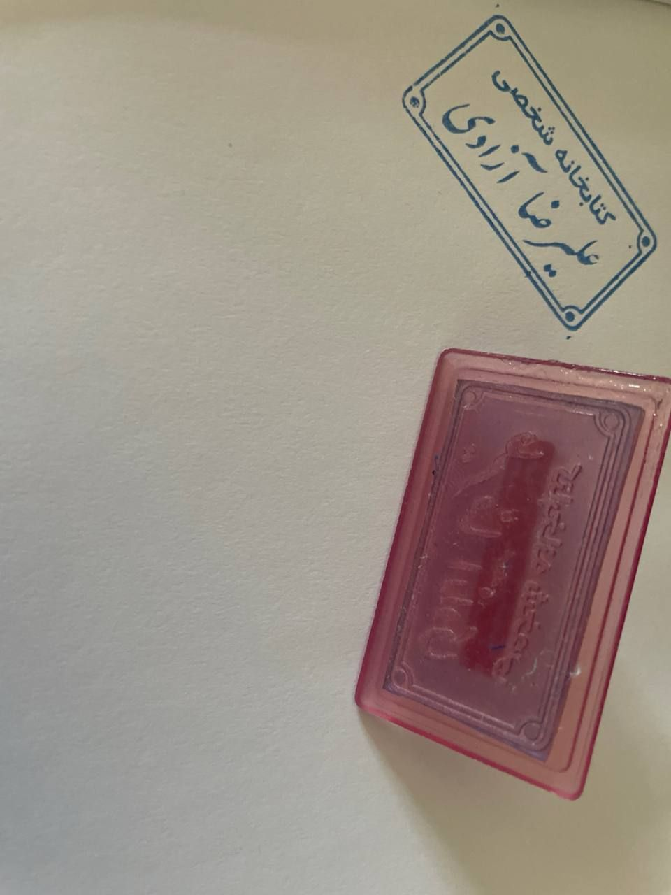

Hello. 
In late January, [I abandoned Agora](https://t.me/dr_biglari_ds/3336). With a mountain of anger and sorrow. Anger at everything. There was nothing to be done about it either. In order to move life forward, but well, it didn't happen. Around the same time, I also logged out of my Telegram account. I didn't have the energy for all this turmoil among all these people. Not that I wanted to bury my head in the sand like an ostrich. In fact, I sharpened my eyes and ears more than ever and became more occupied with following the clues and narratives. But I simply couldn't endure the tension and friction with others anymore. I didn't want to speak even a single word with anyone. I just wanted to listen and not give an opinion. And if I had one, to keep my opinion to myself. I was perhaps one spark away from my head exploding and the rotten pieces of my brain splattering on the doors and walls. 

Now a few weeks have passed since that day. There is a war in Iran. And the internet, as always, is cut off. With immense effort, I tried to keep one or two of my friends and my family connected. I don't like to talk about the war. Not that I don't have anything to say. No. Actually, I have a whole book's worth of things to say, not just about the war itself, but about what the people are going through. From the perspective of an expat who is both seeing those far from their homeland up close and mingling among them, and as an Iranian far from home. But still, I don't want to say anything. Maybe I'm afraid. Or maybe I still don't have the endurance for friction with anyone. Whatever it is, I just want to curl up under my computer desk and bite my nails.

I see that usually one or two people visit the blog a day. I am writing this for those who come so they don't think this place is dead. No! What's dead is my brain. For the past two weeks, I've done almost nothing meaningful. I am doing the company's tasks with apathy, delays, and a lot of procrastination as well. During the days, like a corpse on the bed, I occupy myself with doomscrolling the Explore page until I get tired and switch to playing Clash. For however many hours I can endure, I constantly waste my life and time bouncing between these two. I don't have the energy to tinker with the new code I threw together for the blog a while ago over a few midnights—which resulted in what you see—and fix its bugs. Or to update that "Favorites" section. Or to add the movies I have watched and am watching.

Now, to this sweet state, dopamine poisoning from reactivating Instagram, relentless doomscrolling, and daily hours-long episodes of depersonalization have been added. You might ask, what does depersonalization feel like? What even is it?
Don't expect me, in this condition, to write the explanation myself. For now, settle for this which I grabbed from Gemini: 

**Depersonalization** is a psychological state and a type of dissociative experience in which a person feels detached from themselves, their thoughts, feelings, or their body.

In this state, the person feels as if they have become an **outside observer** of their own life; as if they are watching a movie of their life or functioning like a robot with no control over their movements.

## Main Symptoms

- **Sense of detachment:** The feeling that your thoughts, movements, or body do not belong to you.
    
- **Emotional and physical numbness:** Inability to show emotional reactions or fully sense the physical environment.
    
- **Dream-like feeling:** The feeling that you are trapped in a dream or a fog.
    

> **Important Note:** In a state of depersonalization, the individual is fully aware that this is just a "feeling" and not reality (their connection to reality is not severed). This very awareness is what makes the experience so terrifying, but it distinguishes it from disorders like hallucinations or psychosis.

## Causes

This state is usually the brain's defense mechanism to disconnect from an intolerable situation and often occurs for the following reasons:

- Extreme stress and psychological pressure
- Past traumatic and damaging experiences
- High anxiety, depression, and Panic Attacks
- Severe lack of sleep or the use of certain psychoactive substances

This condition intensifies in people like me who have ADHD during times when attention deficit worsens and concentration is minimized. As if we weren't messed up enough already, this is the cherry on top! Infinite thanks, truly! Sometimes, there's really nothing you can do about it. It's as if a spot inside your skull is itching, and the more you pay attention to it, the more it drives you crazy. Last night I wanted to put a gun in my mouth and pull the trigger, hoping maybe I would snap out of this mental fog. But well. We are renters here, and I don't want the landlord to deduct from our deposit money for staining his white wall.

All this rambling for what? Just to say that my mental state is not favorable, and that's why it looks like a graveyard in here. However, something interesting happened with Agora. A few days after I shut it down, I noticed suddenly about forty new members joined, though some of them have dropped off by now. And now with the internet cut off, no one is online to even leave the channel.

To snap out of this state, for a start, I deactivated this embodiment of evil, Instagram, once again. I want to try to do my company tasks and get dopamine from completing my tasks. To continue my open books. Especially [100 Go Mistakes](https://100go.co/), which I waited months for it to arrive from Iran, and in the end, it fell through again and stayed in Tehran. Ultimately, I asked the company to provide a budget so I could buy the book. I didn't want it to come to this because this way I have to return the book, and I can't stamp "Alireza Azadi's Personal Library" on its first page. I am waiting to receive the print edition of the [How it works](https://www.howitworksdaily.com/) magazine I subscribed to. A magazine that in many ways resembles my old bosom buddy, "Danestaniha". Remind me to write a bit about Danestaniha later. I also have a multi-year archive of its magazines, though I have nothing of them here except their photos. They are all in my bed drawer back home. The ones who should do a damn thing so we can get out of this misery aren't doing it, so at least I should do something my size to not sink any further. I don't want to stay in my mental fog forever and get lost in there. I don't want [pyramid head](https://en.wikipedia.org/wiki/Pyramid_Head) to come for me one day and peel the skin off my flesh. 

There is a lot to say, but this is enough for now. Let the rest be for other days and other posts. Thanks for sticking around this far. 
Yours sincerely.
Alireza.

P.S.: This is the stamp I talked about.
