شاید چند سالی باشه که خیال راه‌انداختن یک آزمایشگاه کامپیوتری خونگی (همون homelab) رو داشتم ولی هیچ‌وقت شرایطش فراهم نبود. یا درگیر درس و دانشگاه بودم که این یعنی این‌که خونه نبودم. یا این‌که امکان مالیش فراهم نبود. یا این‌که حوصله‌ش نبود و همیشه هم ضعف در درک درست شبکه به‌خاطر نداشتن تجربه‌ی عملی، من رو از این‌که به تجربه‌ی عملی بپردازم برهزر می‌داشت. طوری که انگار گرفتار دوری باطل شده بودم. از ترس بلد نبودن، هیچ‌وقت اقدام به تجربه‌ برای یادگرفتن نمی‌کردم.

حالا بعد از گذشت چندسال، بعد از پاس کردن درس‌هایی مثل «شبکه‌های کامپیوتری»، «آزمایشگاه شبکه»، «امنیت شبکه» و خوندن بخش‌هایی از کتاب[ Computer Networking: A Top-Down Approach از Kurose و Ross](https://www.goodreads.com/book/show/83847.Computer_Networking) در طی کارشناسی، و درس «Computer Security» در طی ارشد، و البته خرده‌تجربه‌های عملی از سرکنجکاوی و جبری برخاسته از ایرانی بودن (بله. فیلترینگ رو می‌گم) و البته تموم کردن بازی فرسایشی تحصیل، دسترسی به اینترنت پایدار در خونه (من اینجا از اوپراتور TIM یک FTTH 10Gb گرفتم. با قیمت ماهیانه ۳۰ یورو که به‌نظرم واقعا ارزونه) دیگه بهونه‌ای وجود نداشت که نخوام خودم رو با این کار سرگرم کنم. 

بخش عمده‌ای این پست، به‌ کار‌هایی که از دو سال پیش شروع کردم می‌پردازه. فکر می‌کنم که مفیده که بگم که این ماجرا از کجا شروع شد و چه روندی طی شد. کمی راجع‌به وضعیت فعلی شبکه‌ی خونه بگم و بعد برم سراغ برنامه‌ی گسترش شبکه. 

### نقطه‌ی شروع: به‌کار بستن هارد اکسترنال بلااستفاده

سال ۱۳۹۶، شب قبل این‌که بارم رو جمع کنم و برم شاهرود، می‌خواستم از هاردهای کیس خونه، بخشی از آرشیو آهنگ‌هام رو که در طی سال‌های راهنمایی و دبیرستان با اینترنت ADSL جمع کرده بودم رو انتقال بدم به لپ‌تاپم. لپتاپ رو هم همون روزها خریده بودم: [Asus K556UQ](https://kelaptop.com/en/asus-k556uq-dm801d-k556uq-dm801d). لپتاپی که سه سال پیش با خرید Macbook Pro M2 بالاخره بعد از حدود ۶-۷ سال بازنشست شد. البته به‌نظر نمیاد که بازنشستگی چندان ادامه‌دار باشه :) در ادامه راجع‌بهش صحبت می‌کنم. از بحثمون دور نشیم! شب آخر هفته بود. خیلی از مغازه‌ها بسته بودند. خودم رو بدو رسوندم به پاساژ تقوی. مغازه‌ی ته طبقه‌ی پایین پاساژ هنوز باز بود. خیلی فرصت بررسی هارد‌ها رو از قبل نداشتم و برای همین، از فروشنده خواستم که خودش یک هارد اکسترنال 1TB خوب به من معرفی کنه اون هم [Transcend StoreJet 25H3](https://it.transcend-info.com/product/external-hard-drive/storejet-25h3) رو پیشنهاد کرد. یک سری توضیح داد راجع‌به خرابی‌های کمش و این‌که داخلش هاردی که هست فلانه و بهمانه که خلاصه تصمیم گرفتم همون رو بگیر. قیمت؟ ۱۶۰ هزارتومن :) اون موقع دلار حدود ۴ هزارتومن بود….


حالا بعد از چندسال، با اومدنم به میلان، و استفاده از Google Drive و iCloud، عملا نیازی به استفاده از هارد اکسترنال نداشتم. همه‌چیز روی cloud ذخیره می‌شند و از همه‌جا قابل دسترس‌اند. ولی این چیزی نبود که من دوست داشته باشم. اون کرمی که از وجوه گیکی شخصیتمه،  دوست داشت که این هارد رو ببنده به گاری و ازش کار بکشه و چی از این بهتر که بتوانم مثل NAS ازش استفاده کنم (می‌دونم که [NAS](https://en.wikipedia.org/wiki/Network-attached_storage) شرایط و ویژگی‌هایی داره که با این هارد به تنهایی قابل پیاده‌سازی نیست. من برای ساده‌سازی و به صرف شباهت این‌طور عنوانش کردم). می‌خواستم از این هارد به صورت یک درایو رمزگذاری شده با استفاده از [VeraCrypt](https://en.wikipedia.org/wiki/VeraCrypt) استفاده کنم و فایل‌هایی که می‌خوام رو از طریق شبکه روش انتقال بدم. برای انجام این کار، نیاز به دستگاهی داشتم که بتوانم هارد رو بهش وصل کنم، روش VeraCrypt نصب کنم و از طریق پروتکلی هارد رو در شبکه قابل دسترس کنم….


### شروع یک آغاز: خرید Raspberry Pi 5 

من معمولا به ابزار علاقه‌مند می‌شم و بعد براش چاله‌ای می‌کنم که برای حل اون مشکل از اون ابزاری که می‌خوام استفاده کنم. ماجرا خرید رزبری هم همین بود :) از قبل‌ترش برنامه داشتم که رزبری بری بخرم و نیاز داشتم به سناریویی که از اون بتونم استفاده کنم. که یکی از اون‌ها همین ماجرای NAS بود و فقط به این مقدار هم دل‌خوش نبودم. برنامه‌های بیشتری براش داشتم :) برای همین مدل [Raspberry Pi 5 **8Gb** RAM Starter Kit](https://www.robotstore.it/en/Raspberry-Pi-5-8GB-Starter-Kit) رو گرفتم. این کیت شامل اقلام زیر بود:

- بورد رزبری پای ۵ مدل ۸ گیگابایت رم
- کیس سفید-قرمز با فن
- آداپتور ۲۴ وات

در روتر یک IP ثابت `192.168.1.10`  به رزبری دادم (درصورتی که این کار رو نمی‌کردم، هربار که روتر ری‌استارت می‌شد، می‌تونست IP جدید به رزبری بده و این‌طوری من هربار باید IP رزبری رو روی دستگاه‌های دیگه که داشتم استفاده می‌کردم تغییر می‌دادم که اصلا کار خوش‌آیندی نیست) و حالا می‌تونستم هارد رو به رزبری وصل کنم و بعد از انکریپشن، اون رو از طریق [SMB](https://en.wikipedia.org/wiki/Server_Message_Block) روی شبکه به‌اشتراک بذارم.


تقریباً همون موقع تصمیم گرفته‌م که از این امکان استفاده کنم و بات‌های تلگرامی که پیاده کرده بودم رو روش اجرا کنم. یکی از اون بات‌هایی که نوشتم و خیلی به‌دردبخور بود در یکی‌دو سال اول که میلان بودم هم برای خودم و هم برای بقیه‌، باتی بود برای ساخت سبد‌های خرید ۵ یورویی (ارزش تیکت‌های منسا). با این‌که دیگه این بات استفاده‌ای نداره، ولی دوست دارم که کمی راجع‌بهش بنویسم. 

#### مسئله‌ی کلاسیک کوله‌پشتی: باتی برای خرج بهینه‌ی تیکت‌های منسا

دانشجوهایی که با[ بورس استانی DSU](http://polimi.it/en/students/tuition-fees-scholarships-and-financial-aid/university-financial-aid-diritto-allo-studio-universitario-dsu) در ایتالیا (به طور مشخص در دانشگاه پلی‌تکنیک میلان) تحصیل می‌کنن، روزانه تیکت خرید ۵ یورویی دریافت می‌کنن. عدد ناچیزیه حتی برای دانشجو‌ها و برای همین، خیلی از بچه‌ها اقدام به share کردن تیکت‌هاشون می‌کردن. مثلا ۴ نفر تیکت‌های یک روزشون رو به یکی از اون اعضا می‌دادن که خرید‌های اساسی‌ش (مثل مرغ و برنج و….) رو انجام بده. اما یک چالش این وسط وجود داشت: با هر تیکت فقط می‌شد یک سبد خرید ایجاد کرد و اون رو باهاش پرداخت کرد. مثلا اگر مجموع خرید‌ها ۲۰ یورو می‌شد،  باید اقلام رو به ۴ سبد متفاوت تقسیم می‌کرد و هربار یکی از این سبد‌ها رو با یکی از کد‌ها پرداخت کرد. در ظاهر کار مشکلی به‌نظر نمیاد ولی چالش اینجاست که اقلام قیمت‌های مختلف و تا دو رقم اعشار دارند و معمولا برای دانشجو‌ها (با یورو اون زمان ۳۰ الی ۵۰ تومن) حتی یک یورو هم مهم بود. برای همین باید طوری سبد‌های خریدشون رو می‌چیدن که قیمت هر سبد خرید نزدیک‌ترین حالت ممکن به ارزش هر تیکت (۵ یورو) می‌شد. 


چیدمان بهینه و سریع این اقلام در شلوغی فروشگاه و دستگاه‌های پرداخت در حالی که باقی اعضای گروه منسا منتظرن که تو ازشون تیکت بگیری و کلی آدم که پشت سرت صف واستادن کار آسونی نبود. حداقل برای من استرس‌آور بود. برای همین باتی نوشتم که لیست اقلام و قیمت‌ها رو می‌شد بهش بدی و اون‌ها رو در سبد‌های خرید مختلف، به طوری که قیمت هر سبد خرید ‌نزدیک‌ترین عدد به ۵ یورو باشه پخش می‌کرد. به عنوان مثال، در حالتی که شما ۴ تیکت ۵ یورویی داشتید و مجموع خریدتون ۲۲ یورو می‌شد، در حالت بهینه شما فقط باید ۲ یورو بیشتر پرداخت می‌کردین (چرا که ۲۰ یوروش رو با تیکت‌ها پوشش دادین). این بات تلاش می‌کرد جایگشتی از اقلام رو در سبد‌های مختلف بچینه که پولی که شما میدین تا حد ممکن به ۲ یورو نزدیک باشه. 

اول این بات رو برای خودم نوشتم و بعد به هم‌خونه‌ای‌هام دادم و بعد باقی دوستام و این‌طور نیاز بود که همیشه این بات بالا باشه. حالا که رزبری رو داشتم این امکان وجود داشت. کامپیوتری که همیشه روشنه و مصرف کمی هم داره. بات رو [Dockerized](https://www.docker.com/) کردم و گذاشتمش توی یک فایل [`docker-compose`](https://docs.docker.com/compose/) که راحت بتوانم هروقت که خواستم دیپلویش کنم یا جابجاش کنم. بات هم یکی دو سال بالا بود و بعدش به‌خاطر این‌که توی سیستم جدید کد‌های منسا می‌شد که کد‌ها رو باهم در یک سبد خرید زد دیگه نیازی بهش نبود و آوردمش پایین. 

### کم‌تر کردن شر تبلیغات: راه‌اندازی AdBlocker در سطح DNS

یکی از اهداف اولیه‌م از همون اول این بود که بتوانم یک [DNS](https://www.cloudflare.com/learning/dns/what-is-dns/) سرور راه بندازم که باهاش بتوانم روی تمام دستگاه‌های داخل شبکه، در سطح DNS تبلیغات رو بلاک کنم. ابزار‌هایی هم مثل [Pi-Hole](https://pi-hole.net/) و [AdGuard Home](https://adguard.com/en/adguard-home/overview.html) برای همین کار از قبل وجود داشتن. با وجود رزبری، این هم به‌راحتی میسر می‌شد. منAdGuard Home رو انتخاب کردم (هرچند که شاید در آینده‌ی نزدیک، سراغ PiHole هم برای تست برم) و کانتینرش رو روی رزبری بالا آوردم. حالا کافی بود در تنظیمات DNS دستگاه‌هام، `192.168.1.10` رو ست کنم. این‌طوری درخواست‌های DNS به رزبری و بعد به AdGuard Home می‌رسید و از اون‌جا از طریق [DoT (DNS over TLS)](https://www.cloudflare.com/learning/dns/dns-over-tls/) به دی‌ان‌اس سرور‌های [Adguard DNS](https://adguard-dns.io/en/welcome.html) (که DNSهای تبلیغاتی رو فیلتر می‌کنن). به این‌ترتیب علاوه بر این‌که درخواست‌های DNS رمزگذاری می‌شدن و برای ISP قابل دیدن نبودن، درخواست‌هایی که سرور‌های تبلیغ می‌رسید هم جواب ناصحیح داده می‌شد. این‌طوری تبلیغات در اپ‌ها و سایت‌ها نمی‌تونستند load بشن.


می‌شد کار رو کمی ساده‌تر کرد به طوری که هر کسی که به روتر خونه وصل می‌شد، نیازی نداشته باشه تا که IP رزبری رو به صورت دستی ست کنه. AdguardHome قابلیت [DHCP Server](https://en.wikipedia.org/wiki/Dynamic_Host_Configuration_Protocol) رو داشت. این‌طوری به‌جای این‌که روتر اقدام به IP دهی به دستگاه‌های شبکه بکنه، کار رو AH انجام می‌داد. مدتی از این ماجرا استفاده کردم ولی به دلایل نامشخصی (که البته چندان هم فرصت پیگیری نداشتم) بعد از هربار ری‌استارت مودم یا وصل شدن دستگاه‌های جدید، عملیات IP گرفتن تا چندین دقیقه طول می‌کشید. این‌طور شد که تصمیم گرفتم به حالت دستی برگردم. 


### مانیتورینگ و سرویس‌های مختلف

حالا که تعداد سرویس‌هایی که روی رزبری داشت بیشتر می‌شد، برای همین فرصتی پیش اومد که کمی کار با [Grafana](https://grafana.com/docs/grafana/latest/visualizations/panels-visualizations/) رو تجربه کنم. برای این منظور‌هم چهار سرویس مختلف لازم بود که بالا بیاد:

- برای مانیتورینگ وضعیت docker containerها: [cAdvisor](https://github.com/google/cadvisor).
- برای و وضعیت خود سیستم مثل رم، CPU،  میزان استفاده از IO و…: [node_exporter](https://github.com/prometheus/node_exporter).
- برای نمایش آمار و نمودار‌ها: [Grafana](https://grafana.com/).
- و در نهایت دیتابیسی برای ذخیره‌ی لاگ‌ها: [Prometheus](https://prometheus.io/). 

کلیات ارتباط بین این سه هم به‌این صورته که [node_exporter](https://github.com/prometheus/node_exporter) اقدام به جمع‌آوری اطلاعات می‌کنه از host می‌کنه و [cAdvisor](https://github.com/google/cadvisor) هم اقدام به جمع‌آوری اطلاعات کانتینرهای می‌کنه و اون‌رو در دیتابیس سری‌زمانی Prometheus ([TSDB](https://en.wikipedia.org/wiki/Time_series_database)) ذخیره می‌کنه (هر دوی این‌ها exporterهای Prometheus هستند) گرافانا هم یک پنله که قابلیت وصل شدن به تعداد زیادی دیتابیس از جمله Prometheus رو داره اطلاعات رو از روی اون کوئری می‌کنه.

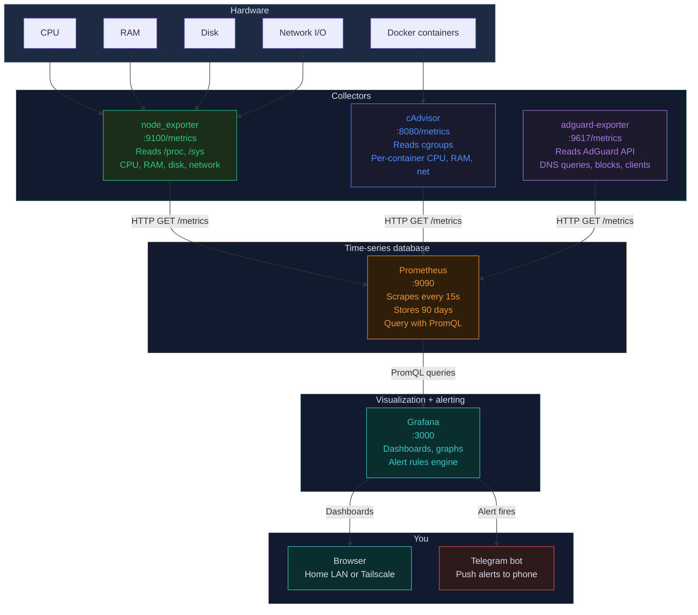

 انجام این کار باعث شد که کمی با خود پنل گرافانا و قابلیت‌هاش آشنا بشم. مثلا از اون‌جایی که بعضی شب‌ها صدای فن رزبری زیاد شده بود،  یک پنل کاستوم جدید اضافه کردم که امکان نشون دادن وضعیت سرعت فن رو با یک مقیاس کیفی نشون می‌داد. یا این‌که کمی بیشتر راجع‌به خود Prometheus خوندم تا کمی بی‌شتر راجع‌به دیتابیس‌های [time-series](https://en.wikipedia.org/wiki/Time_series_database) بدونم.


### ایرانی بودن

از حدود ۱۴۰۱، همون‌سالی که من اومدم میلان، استفاده از کانفیگ‌های پروتکل‌هایی مثل [VLESS](https://habr.com/en/articles/990144/)، [VMess](https://xtls.github.io/en/development/protocols/vmess.html) و [Trojan](https://trojan-gfw.github.io/trojan/protocol.html) و امثالهم خیلی رایج شده بود. کلی هم اصطلاحات جدید و مفاهیمی که هیچ‌وقت نشنیده بودم در اومده بود. تمام این‌ها به این‌خاطر بودن که اوضاع فیلترینگ در ایران روز به روز وخیم‌تر می‌شد و نیاز به صدجور شعبده برای دور زدن [DPI](https://en.wikipedia.org/wiki/Deep_packet_inspection) و فایروال بزرگ و امثالهم بود. از اون‌جایی که تمام دوستان من و خانواده‌م ایران بودن، نیاز بود که همیشه اون‌ها رو وصل نگه دارم. این کار رو همیشه با خرید وی‌پی‌ان‌های مختلف انجام می‌دادم. تا مدت‌ها می‌شد همچنان با وی‌پی‌ان‌هایی مثل [Express VPN](https://www.expressvpn.com/) فیلترینگ رو همچنان دور زد ولی این عافیت اندیشی و راحت‌گرفتن واقعا چیزی نبود که دوست داشته باشم. کلی مفهوم جدید معرفی شد که من حتی اسم‌شون رو هم نشنیده بودم و این نابلدی داشت منو آزار می‌داد. این ماجرا تا وقتی ادامه داشت که خوردیم به [خیزش دی‌ماه ۱۴۰۴‌](https://fa.wikipedia.org/wiki/%D8%AE%DB%8C%D8%B2%D8%B4_%DB%B1%DB%B4%DB%B0%DB%B4_%D8%A7%DB%8C%D8%B1%D8%A7%D9%86). خیزشی که از ۷م دی‌ماه شروع شد و به خونین‌بار ترین روز‌هاش در ۱۷‌م و ۱۸‌م رسید. چنان کشتاری که حتی غرق شدن در دل تاریخ نمی‌تونه خون‌های ریخته شده رو پاک کنه.

در جمهوری اسلامی همه‌چیز با عینک امنیتی/سیاسی دیده می‌شه و در رابطه‌ش تصمیم گرفته میشه. اینترنت هم از این قاعده مثتسنی نبود. اینترنت، به‌جای زیرساختی حیاطی بودن مثل برق و آب، تبدیل به یک مسئله‌ی امنیتی شده و روز به روز بیشتر به سمت تبدیل شدن به یک اینترانت ملی پیش رفت. اولین بار در[ آبان ۱۳۹۸](https://fa.wikipedia.org/wiki/%D8%A7%D8%B9%D8%AA%D8%B1%D8%A7%D8%B6%D8%A7%D8%AA_%D8%A2%D8%A8%D8%A7%D9%86_%DB%B1%DB%B3%DB%B9%DB%B8_%D8%A7%DB%8C%D8%B1%D8%A7%D9%86)، با شعله‌ور شدن اعتراضات به چندبرابر شدن یک‌شبه‌ی قیمت بنزین، برای اولین بار اینترنت برای طولانی مدت به طور کامل قطع شد. اون روزها من خوابگاه بودم و خاطرم هست که تقریباً ۱۰ روز دسترسی به اینترنت نداشتم. با کلی مکافات و ارتباط، تونستم به کانفیگ‌های تلگرام دسترسی پیدا کنم که حداقل اخبار رو در تلگرام دنبال کنم. این قطع شدن اینترنت به دهن مملکت‌دار‌ها شیرین اومد و در هر بزنگاهی دست به قطع کردن اینترنت زدن. 

این‌بار در دی‌ماه ۱۴۰۴ هم همین ماجرا پیش اومد. دیگه وی‌پی‌ان‌های مرسوم کار نمی‌کردن و چاره‌ای جز استفاده از پروتکل‌های جدید نبود. برای همین تصمیم گرفتم برای این‌که از هاست‌های معمول استفاده نکنم و VPN server رو روی اینترنت خونه بیارم بالا. چرا که هاست‌ها، عموماً رنج IP مشخصی دارند و در تشکیلات فیلترینگ شناسایی شده‌ندو. همین می‌تونست ریسک فیلتر شدن رو در حالت‌هایی بالا ببره. برای این کار هم، از پنل [3x-ui](https://github.com/MHSanaei/3x-ui) استفاده کردم و یک کانتینر از اون رو روی رزبری آوردم بالا. 3x-ui، رابط وبیه که روی هسته‌ی [Xray-core](https://github.com/xtls/xray-core) درست شده و امکان ایجاد کانفیگ‌های مختلف روی پروتکل‌های مختلف می‌ده. در طی مدتی که روی این ماجرا کار کردم، با اون مفاهیم جدیدی که راجع‌بهشون صحبت کردم رو باهاشون بیشتر آشنا شدم و تونستم بهتر درکشون کنم. 
در کنار این پنل، نیاز به استفاده از [cloudflare-ddns](https://github.com/timothymiller/cloudflare-ddns) هم بود و این به‌خاطر [ماهیت داینامیک بودن IP‌های اینترنت‌های خونگی](https://www.cloudflare.com/learning/dns/glossary/dynamic-dns/)ه. 
به خاطر ماجرایی که توضیحش طولانیه و خارج از بحث، باید IP سرور رو در DNS recordهای پنل [Cloudflare](https://www.cloudflare.com/) ست می‌کردیم. از اونجایی که سرور IP اینترنت خونگی من بود و این ممکن بود با خاموش روشن شدن مودم حتی عوض بشه، و همین باعث می‌شد که تمام کانفیگ‌هایی که به دوستان و خانواده‌م دادم از کار بیفته. به همین‌خاطر نیاز بود که همیشه پنل Cloudflare از IP جدید من مطلع باشه. وظیفه‌ی cloudflare-ddns هم همین بود. به‌صورت دوره‌ای IP من رو چک می‌کرد و اون رو در پنل Cloudflare آپدیت می‌کرد. هرچند که این ماجرا یک ماه بیشتر دووم نداشت….


یک روز که توی اینستا لاگین کردم، یک ایمیل اومد از طرف متا که یک دستگاه جدید از تهران(!) به اکانت شما لاگین کرده. چندثانیه بیشتر طول نکشید که علت برام روشن بشه. همه‌چیز زیر سر VPN server بود! ماجرا از این قرار بود که دوستان من که تهران زندگی می‌کردن و از VPN serverای که روی خونه راه انداخته بودم استفاده می‌کردن، اینستاگرام داشتن. اپ اینستاگرام به طور عمومی دسترسی به موقعیت مکانی از طریق [GPS](https://ciechanow.ski/gps/) داره. از طرفی، اون‌ها از طریق اینترنت خونه‌ی ما به اینترنت و من‌جمله اینستاگرام وصل می‌شدن. بعد از مدتی استفاده، از نظر سرور‌های اینستاگرام، درسته که IP که باهاشون متصل می‌شدند مال میلان بود، ولی موقعیت جغرافیایی‌شون به وضوح نشون می‌داد که تهران زندگی می‌کنن. و ظاهرا (و البته منطقا) وزن موقعیت مکانی واقعی از IP بیشتر بود، IP‌ اینترنت خونه‌ی ما لیبل تهران خورده بود. ماجرا فقط محدود به متا هم نبود. تقریباً یکی دو روز بعد هم متوجه شدم که این ماجرا در گوگل هم پیش اومده و من نمی‌تونم به قسمت‌هایی که قبلا می‌رفتم حالا برم و به من ایراد می‌گرفت که فلان این سرویس در کشور شما (ایران) پشتیبانی نمی‌شود. 


برای این‌که رفع بلا کنم، سریع تمام کانتینر رو انتقال دادم به سرور [OVH](https://www.ovhcloud.com/en/)ای که از قبل داشتم. حالا دیگه نیازی به استفاده از ddns نبود. چرا که [VPS](https://en.wikipedia.org/wiki/Virtual_private_server) serverها IP ثابت (static) دارند. همون رو توی پنل ثبت کردم و تمام. البته این ماجرا هم خیلی دووم نیاورد. با شروع شدن جنگ آمریکا و اسرائیل با ایران، اینترنت این‌بار به شکل تاریخی‌ای قطع شد. تقریباً بجز کسایی که [Starlink](https://www.starlink.com/) داشتند، کسی از توی ایران حداقل وصل نبود (و هنوز بعد از گذشت این همه مدت، هم‌چنان وضعیت وخیمه) حتی دو هفته‌ی اول از ۱۷ دی‌ماه به بعد هم اینترنت این‌طوری قطع شده بود. البته همون زمان بود که روش [dnstt](https://www.bamsoftware.com/software/dnstt/) مطرح شد که امکان انتقال اطلاعات رو داخل پکت‌های DNS می‌داد. هرچند که بعد از اون مدت، دوباره می‌شد با همون کانفیگ‌های قدیمی [V2Ray](https://www.v2ray.com/) به اینترنت وصل شد. ولی این بار، در دوران جنگ همچنان روش‌های مرسوم کار نمی‌کنن. فضایی آماده شد که اینترنت طبقاتی رو اجرایی کنند. الان کانفیگ‌هایی که با قیمت‌های نجومی تا گیگی چندین یورو به فروش می‌رند همشون برای یکی از این به اصطلاح سرور سفید‌ها یا که کانفیگ استارلینک‌ند. البته یکی دو روز پیش بود که دوباره یکی سری از دومین‌های خارجی رفع فیلتر شدن و همز‌مان با اون روش [SNI Spoofing](https://github.com/patterniha/SNI-Spoofing) هم توسط آدمی ناشناس پابلیک شد که خیلی سریع بین مردم پخش شد و امکان وصل شدن به اینترنت جهانی رو به خیلی‌ها داد. هرچند که امروز صحبت‌هایی بود از این‌که دارند تلاش می‌کنن جلوی این رو هم بگیرند. این‌که این روش‌ها چی‌اند و چی‌کار می‌کنند باشه برای پست دیگه. صرفاً خواستم حالا که دارم راجع‌به وضعیت فیلترینگ صحبت می‌کنم، این بخش رو تا حد ممکن کامل کنم. بگذریم……

### تعریف domain برای سرویس‌های داخلی 

یکی از کارهایی که به‌نظرم منطقی بود و باید زودتر انجام می‌شد این بود که به‌جای این‌که به سرویس‌های مختلف (مثل پنل ادگارد یا گرافانا) با وارد کردن IP رزبری و پورت سرویس دسترسی داشته باشم، به اون‌ها از طریق یک دامین دسترسی پیدا کنم. مثلا به‌جای این‌که تایپ کنم: `192.168.1.10:3000` که پنل ادگاردهوم واسم باز بشه، توی مرورگر بزنم: `http://adguard.home`.

برای این منظور، نیاز به انجام چند کار داشتم:
- تبدیل دامنه به IP اساس کار [DNS](https://www.cloudflare.com/learning/dns/what-is-dns/)ـه. یعنی وقتی ما از یک وب‌سایت فقط دامنه رو می‌دونیم و می‌خواییم به IPش برسیم برای اتصال بهش، آدرس رو از دی‌ان‌اس سرور می‌پرسیم. برای این‌که این سناریو را شبکه‌ی خونه پیاده کنم باید می‌رفتم سراغ دی‌ان‌اس سرورمون: Adguard Home. توی پنل، امکان تعریف دامنه و ایجاد map وجود داره. من هم برای سرویس‌های ادگارد، گرافانا، Prometheus، اقدام به تعریف map کردم. ولی این کار به‌تنهایی کافی نیست. 


- برای این‌که درخواست‌ HTTP که به یک دامنه زده می‌شه به کانتینر مورد نظر برسه، نیازه که از یک [reverse proxy](https://www.cloudflare.com/learning/cdn/glossary/reverse-proxy/) استفاده کنیم. و من از [nginx](https://nginx.org/) استفاده کردم. شیوه‌ی کار هم به‌طور کلی اینه که من تول پنل ادگارد تمام دامنه‌هایی که می‌خوام رو به آدرس `192.168.1.10` map می‌کنم. در لایه‌ی بالاتر، این nginx است که که تشخیص می‌ده بر اساس URL، درخواست باید به کدوم کانتینر برسه. این‌طوری تونستم به اون هدفی که می‌خواستم برسم. در ادامه، فایل `docker-compose.yml‌`ای که الان دارم استفاده می‌کنم روی رزبری، به انضمام کانفیگ nginx رو می‌ذارم. 

docker-compose.yml

```yml
services:
 # --- Nginx (The Gateway) ---
 nginx:
  image: nginx:latest
  container_name: nginx_proxy
  restart: unless-stopped
  ports:
   - "80:80"
  volumes:
   -./nginx/nginx.conf:/etc/nginx/nginx.conf:ro
  depends_on:
   - grafana
   - prometheus
  networks:
   - internal_net

 # --- AdGuard Home (DNS & DHCP) ---
 # Note: Must use 'network_mode: host' to see real device IPs for DHCP
 adguard:
  image: adguard/adguardhome
  container_name: adguard
  restart: unless-stopped
  volumes:
   -./adguard/conf:/opt/adguardhome/conf
   -./adguard/work:/opt/adguardhome/work
  network_mode: host

 # --- Grafana (Visual Dashboard) ---
 grafana:
  image: grafana/grafana
  container_name: grafana
  restart: unless-stopped
  environment:
   - GF_SECURITY_ADMIN_PASSWORD=admin
   - GF_SERVER_ROOT_URL=http://grafana.home
   - GF_SERVER_DOMAIN=grafana.home
  volumes:
   - grafana_data:/var/lib/grafana
  networks:
   - internal_net

 # --- Prometheus (The Data Collector) ---
 prometheus:
  image: prom/prometheus
  container_name: prometheus
  restart: unless-stopped
  command:
   - '--config.file=/etc/prometheus/prometheus.yml'
   # Removed '--web.external-url' because we are now using a subdomain (prometheus.home)
  volumes:
   -./prometheus/prometheus.yml:/etc/prometheus/prometheus.yml
   - prometheus_data:/prometheus
  networks:
   - internal_net

 # --- cAdvisor (Docker Monitor) ---
 cAdvisor:
  image: gcr.io/cAdvisor/cAdvisor:latest
  container_name: cAdvisor
  restart: unless-stopped
  volumes:
   - /:/rootfs:ro
   - /var/run:/var/run:ro
   - /sys:/sys:ro
   - /var/lib/docker/:/var/lib/docker:ro
   - /dev/disk/:/dev/disk:ro
  devices:
   - /dev/kmsg
  networks:
   - internal_net

 # --- Node Exporter (System Monitor - ADDED THIS) ---
 node_exporter:
  image: prom/node-exporter:latest
  container_name: node_exporter
  restart: unless-stopped
  volumes:
   - /proc:/host/proc:ro
   - /sys:/host/sys:ro
   - /:/rootfs:ro
   -./node_exporter/textfiles:/var/lib/node_exporter/textfile_collector:ro
  command:
   - '--path.procfs=/host/proc'
   - '--path.rootfs=/rootfs'
   - '--path.sysfs=/host/sys'
   - '--collector.filesystem.mount-points-exclude=^/(sys|proc|dev|host|etc)($$|/)'
   - '--collector.textfile.directory=/var/lib/node_exporter/textfile_collector'
  networks:
   - internal_net

volumes:
 grafana_data:
 prometheus_data:

networks:
 internal_net:
  driver: bridge
````
nginx.conf

```nginx
user nginx;
worker_processes auto;

error_log /var/log/nginx/error.log notice;
pid /var/run/nginx.pid;

events
{
  worker_connections 1024;
}

http
{
  include /etc/nginx/mime.types;
  default_type application/octet-stream;

  log_format main '$remote_addr - $remote_user [$time_local] "$request" '
  '$status $body_bytes_sent "$http_referer" '
  '"$http_user_agent" "$http_x_forwarded_for"';

  access_log /var/log/nginx/access.log main;

  sendfile on;
  keepalive_timeout 65;

  # =========================================================
  # BLOCK 1: AdGuard Home
  # URL: http://adguard.home
  # =========================================================
  server
  {
    listen 80;
    server_name adguard.home;

    location /
    {
      proxy_pass http://192.168.1.10:3000/;

      proxy_set_header Host $host;
      proxy_set_header X-Real-IP $remote_addr;
      proxy_set_header X-Forwarded-For $proxy_add_x_forwarded_for;
      proxy_set_header X-Forwarded-Proto $scheme;

      proxy_http_version 1.1;
      proxy_set_header Upgrade $http_upgrade;
      proxy_set_header Connection "upgrade";
    }
  }

  # =========================================================
  # BLOCK 2: Grafana
  # URL: http://grafana.home
  # =========================================================
  server
  {
    listen 80;
    server_name grafana.home;

    location /
    {
      proxy_pass http://grafana:3000/;

      proxy_set_header Host $host;
      proxy_set_header X-Real-IP $remote_addr;
      proxy_set_header X-Forwarded-For $proxy_add_x_forwarded_for;
    }
  }

  # =========================================================
  # BLOCK 3: Prometheus
  # URL: http://prometheus.home
  # =========================================================
  server
  {
    listen 80;
    server_name prometheus.home;

    location /
    {
      proxy_pass http://prometheus:9090/;

      proxy_set_header Host $host;
      proxy_set_header X-Real-IP $remote_addr;
      proxy_set_header X-Forwarded-For $proxy_add_x_forwarded_for;
    }
  }
}
```

### دسترسی به شبکه‌ی خونه از خارج: VPN

از همون روز اول دلم می‌خواست می‌تونستم علاوه بر این‌که به دیتای روی هارد اکسترنالم توی شبکه‌ی خونه دسترسی داشته باشم، هرجای دیگه که باشم، هرجا خارج از شبکه‌ی خونه هم دسترسی داشته باشم. ولی چندان احساس نیاز نکردم تا روزی که می‌خواستم بتوانم پنل 3x-ui رو وقت‌هایی که خونه نیستم هم بررسی کنم. برای همین دنبال روشی برای راه انداختن بدون دنگ و فنگ VPN بودم. با یک سرچ ساده، به [Tailscale](https://tailscale.com/) رسیدم.

برای استفاده از Tailscale، باید یک کلاینت رو روی دستگاه‌هایی که می‌خوایید نصب کنین. من یک مورد رو روی رزبری نصب کردم، یکی روی لپتاپ و یکی دیگه هم روی موبایل. تمام این دستگاه‌ها با لاگین توی اکانتتون در tailscale به هم مرتبط می‌شند. مثلا در اکانت من، تمام دستگاه‌های من که با مشخصات من لاگین شدند قابل دسترس‌اند. به هر کدوم یک IP رنج ۱۰۰ داده می‌شه چرا که حالا وصل شدن به وی‌پی‌ان، ما توی شبکه‌ی tailscale قرار داریم. حالا وقتی که VPN وصله، برای این‌که بتوانم به رزبری ssh بزنم، نمی‌تونم آدرس `192.168.1.10` رو وارد کنم چون ما دیگه توی شبکه‌ی خونه نیستیم. ما در شبکه‌ی خصوص Tailscaleایم. حالا رزبری مثلا `IP 100.64.0.61` داره و تنها با این IPه که قابل دسترسه. 

### باقی خرده‌کارها و نکته‌های جانبی

در طی این ماجرا‌ها، من کار‌های ریز دیگه‌ای هم انجام دادم. برای این‌که بتوانم VPN server رو از بیرون قابل دسترس کنم روی پورت‌های کانفیگ‌هایی که می‌ساختم، نیاز بود که [port forwarding](https://en.wikipedia.org/wiki/Port_forwarding) انجام بدم. ماجرا از این قراره که در روتر تنظیم می‌کنی که تمام درخواست‌هایی که از اینترنت به روتر می‌رسه، اگر روی پورت `1361` بود (عدد فرضیه)، این درخواست رو به دستگاه رزبری با `IP `192.168.1.10 انتقال بده. 
یا از طرفی، حالا که داشت یک‌سری پورت روی روتر باز می‌شد، نیاز بود که فایروال‌ رزبری رو که مبتنی بر [UFW (Uncomplicated Firewall)](https://en.wikipedia.org/wiki/Uncomplicated_Firewall) بود رو کانفیگ کنم که فقط روی پورت‌هایی که مشخص کردم و می‌خوام درخواست‌ها رو قبول کنه. در غیر این صورت درخواست رو باید [drop](https://en.wikipedia.org/wiki/Firewall_(computing)) کنه. 
در کنار این کار‌ها، کمی با [DMZ](https://en.wikipedia.org/wiki/DMZ_(computing)) ور رفتم. این‌که داره چی‌کار می‌کنه. یک مقدار هم با [Fail2Ban](https://github.com/fail2ban/fail2ban) ور رفتم. سعی کردم لاگ‌های xray-core رو بخونم ببینم که کسایی که به وی‌پی‌ان من وصل هستند تا کجا می‌تونم درخواست‌هاشون رو observe کنم. با تا چه حد امکان [spoofing](https://en.wikipedia.org/wiki/Spoofing_attack) و یا [intercept](https://blog.cloudflare.com/understanding-the-prevalence-of-web-traffic-interception/) وجود داره. سناریو‌هایی که صرفا از جهت کنجکاوی مقدار کمی باهاشون بازی کردم.

تمام این داستان‌ها رو گفتم که روند تکاملی شکل‌گیری این خواسته رو ببینیم. حالا به‌نظرم وقتش بود که این ماجرا رو بسط بدم. بیشتر آزمون و خطا کنم و بهتر و بیش‌تر یاد بگیرم. 


### نیازمندی‌های یک Homelab

من از ساختن همچین آزمایشگاهی، چند تا هدف دنبال می‌کردم. بجز یادگیری و فانتزی‌های شخصی، می‌خواستم این آزمایشگاه کارکرد‌های مشخصی رو داشته که هر کدوم به شرح زیرند:

- باید شبکه‌ی خونه، به زیرشبکه‌های جدا از هم تبدیل بشه که هر کدوم برای کاری مشخص به‌کار گرفته بشه.
- ایجاد محیطی برای تست پروژه‌های نرم‌افزاری که پیاده می‌کنم به خصوص پروژه‌هایی که در سناریوهای توزیع شده باید بررسی بشند.
- ایجاد محیطی ایزوله برای تست و بررسی بدافزار.
- ایجاد یک مدیاسرور، برای درست کردن پنلی مشابه نت‌فلیکس و ایجاد دسترسی برای کسایی که می‌خوام خارج از شبکه‌ی خونه.
- ایجاد زیرشبکه‌ای که به صورت تضمین شده، امکان استفاده از تورنت رو بدون امکان افشای آدرس IP اصلی فراهم کنه.
- ایجادی محیطی امن و خصوصی برای دسترسی به اینترنت بدون فاش شدن هویت. 
- داشتن شبکه‌ای مجزا برای مهمان‌ها و مانیتور و نظارت روی ترافیک رد و بدل شده در این شبکه.
- ایجاد یک [هانی‌پات](https://en.wikipedia.org/wiki/Honeypot_(computing)) برای بات‌ها و اتکر‌ها و امکان مشاهده‌ی رفتار‌ها و تلاش‌های انجام شده برای نفوذ.
- ایجاد شبکه‌ای ایزوله از شبکه‌ی خونه برای دستگاه‌های [IoT](https://en.wikipedia.org/wiki/Internet_of_things). 
- داشتن یک سیستم کاملا مجزا برای دسترسی ناشناس به وب (مشابه حالت قبلی اما این بار روی یک لپتاپ جدا و با سیستم‌عامل مبتنی بر privacy).
- ایجاد شبکه‌ای مجزا برای دستگاه‌هایی مثل لپتاپ کاری یا شخصی و یا موبایل تبلت. 
- دسترسی جدا و مستقل Xbox به اینترنت.
- دسترسی به زیرساخت‌های شبکه، خارج از خونه با استفاده از VPN. 
- مانیتور کردن وضعیت زیرساخت‌ها و شبکه‌ها و سرویس‌ها و امکان دریافت نوتیفیکیشن از رفتار‌های شبکه روی تلگرام.

### طراحی سطح بالای Network Topology

از این‌جا به بعد، متن مربوط به طرح‌های فرضی و به‌طور کلی،‌ مفروضات شبکه‌ند. یعنی همهٔ چیزهایی که در این بخش می‌بینید الزاماً همین حالا پیاده‌سازی نشده‌اند، بلکه بخشی از آن‌ها نقشهٔ توسعهٔ هوم‌لب هستند. برای خودم مهم بود که معماری از همین ابتدا ماژولار و قابل گسترش طراحی بشن؛ طوری که بعداً اگر سرویس جدیدی اضافه کردم، لازم نباشد کل ساختار را از نو بچینم.

ایدهٔ اصلی طراحی اینه که هر دسته از کاربردها در یک بخش جدا از شبکه قرار بگیرند: سرویس‌های روزمره و شخصی، media stack، محیط توسعه، آزمایشگاه تحلیل بدافزار، شبکهٔ مهمان، شبکهٔ IoT و محیط ناشناس. این جداسازی علاوه بر امنیت، از نظر عیب‌یابی و [observability](https://en.wikipedia.org/wiki/Observability_(software)) هم مفیده، چون دقیق‌تر می‌شه رد ترافیک رو دنبال کرد.
نیازمندی‌ها گسترده‌ بود. تلاش کردم برای این نیازمندی‌ها معماری طراحی کنم (مبتنی بر ایجاد [VLAN](https://en.wikipedia.org/wiki/VLAN)) که در ادامه می‌تونین یک دید کلی از topology شبکه ببینین:


نمودار تعاملی ساخته شده با mermaid chart:

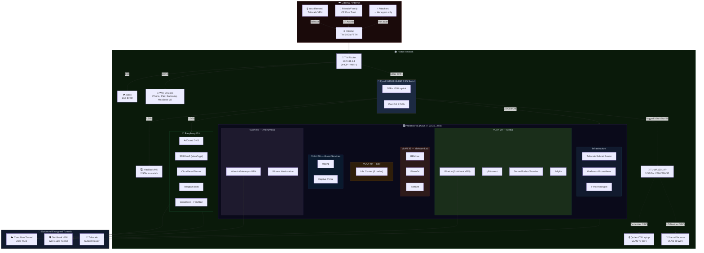

### طراحی فیزیکی سیستم

در طراحی منطقی، همه‌چیز با [VLAN](https://en.wikipedia.org/wiki/VLAN) و VM و container مرتب و منسجم به‌نظر می‌رسه، اما در نهایت باید ببینیم این معماری روی چه سخت‌افزارهایی قراره سوار بشه. برای من مهم بود که تا حد ممکن از تجهیزاتی که از قبل داشتم استفاده کنم و فقط جاهایی هزینه کنم که واقعاً روی قابلیت توسعه و ایزوله‌سازی اثر می‌ذارن؛ به همین دلیل به‌جای خرید یک mini PC جدید، تصمیم گرفتم لپ‌تاپ قدیمی Asusم رو که بالاتر راجع‌بهش صحبت کردم رو به سرور [Proxmox](https://www.proxmox.com/en/) تبدیل کنم و هزینهٔ اصلی را صرف سوییچ managed و تجهیزات شبکه کنم.


علاوه‌بر این، برای انجام VLAN‌بندی، نیازه که از یک سوئیچ [managed](https://en.wikipedia.org/wiki/Network_switch#Managed_switch) استفاده کنم. بعد از کلی بالا و پایین کردن و تلاش برای گرفتن دستگاهی قابل اعتماد ولی با قیمت مناسب، به [Zyxel XMG1915-10E](https://www.zyxel.com/it/it/products/switch/8-16-port-2-5gbe-smart-managed-switch-with-2-sfp-uplink-xmg1915-series/overview) رسیدم. نمی‌دونم چقدر خوبه یا گزینه‌های بهتر در همین رنج قیمت  وجود دارند یا نه. من دسته‌دومِ نو این سوییچ رو ۱۶۰ یورو از آمازون سفارش دادم. اگر کسی نظری یا راهنمایی داشت، خوش‌حال می‌شم به من ایمیل بزنه.


علاوه بر این‌ها، نیازمند ۳ وسیلهٔ دیگه هم بودم. اول از همه، می‌خواستم از پورت [SFP+](https://en.wikipedia.org/wiki/Small_Form-factor_Pluggable) سوئیچ به‌عنوان Uplink استفاده کنم و اون رو وصل کنم به پورت 10G روتر. ولی از اون‌جایی که پورت 10G روتر از نوع [RJ45](https://en.wikipedia.org/wiki/Modular_connector#8P8C) بود نیاز بود که یک تبدیل [10Gtek 10Gb SFP+ RJ45 Copper Module 30-meter (RTL8261 Chip), 10GBase-T SFP+](https://store.10gtek.com/10gbase-t-10g-sfp-30m-copper-rj-45-cat-6a-cat-7-transceiver-module/p-5226) Transceiver بگیرم:


برای درست کردن Access Point هم دنبال گزینه‌های اقتصادی گشتم. در نهایت رفتم سراغ [TP-Link TL-WA1201 AC1200](https://www.tp-link.com/it/home-networking/access-point/tl-wa1201/). با این [Access Point](https://en.wikipedia.org/wiki/Wireless_access_point) این امکان رو دارم که هم‌زمان چند [SSID](https://en.wikipedia.org/wiki/Service_set_(802.11_network)#SSID) درست کنم و به هر کدوم یک VLAN منتسب کنم که به‌کار سناریو ساخت SSID جدا برای مهمان و دستگاه‌های IoT میاد. سه SSID رو در نظر گرفتم:

| SSID | VLAN | Visibility | Purpose |
|------|------|------------|---------|
| Home-Guest | 60 | Visible | شبکه‌ی مهمان — با [Captive Portal](https://en.wikipedia.org/wiki/Captive_portal) |
| QubesNet | 70 | **Hidden** | فقط لپتاپ Qubes OS — با رمز WPA3 قوی |
| IoT-Devices | 80 | Visible | جاروبرقی Xiaomi و دستگاه‌های هوشمند آینده |


در نهایت‌هم، یک سری کابل [Cat8](https://www.cobtel.com/info/cat8-cable-everything-you-should-know-84464412.html). هرچند که نیازی به این کابل‌ها نیست چرا که در‌ بهترین‌حالت، نیاز به یک کابل که 10Gb/s رو ساپورت کنه داریم که اون هم به عنوان آپ‌لینک سوییچ استفاده می‌شه. ولی از اون‌جایی که من توی خونه تمام کابل‌هایی که از قبل گرفتم CAT8 هستند، برای همین تصمیم گرفتم کابل‌های جدید مورد نیاز رو هم از همین تایپ انتخاب کنم.

و درنهایت، برای محیط کاملا ایزوله‌ای که روش قراره [Qubes OS](https://www.qubes-os.org/) نصب کنم، از یک لپتاپ قدیمی دیگه ایسوز که تو کمد افتاده می‌خوام استفاده کنم :)

در ادامه، لیست دستگاه‌ها و کانکشن‌هایی که براشون در نظر گرفتم رو می‌تونید ببنین:

| Device | Specs | Role | Connection | Speed |
|--------|-------|------|------------|-------|
| TIM WiFi 6 Router | 10Gb FTTH, built-in ONT | Internet gateway, DHCP, WiFi 6 | Fiber (FTTH) | 10Gb |
| [Zyxel XMG1915-10E](https://www.zyxel.com/us/en-us/products/switch/8-16-port-2-5gbe-smart-managed-switch-with-2-sfp-uplink-xmg1915-series) | 8×2.5G + 2×10G SFP+ | VLAN backbone, managed switch | SFP+ → Router (10Gtek module) | 10Gb uplink |
| Raspberry Pi 4 | 8GB RAM, ARM, USB HDD | DNS, NAS, CF Tunnel, bots | Switch port | 1Gb (Pi max) |
| Asus i7 Laptop (2019) | 32GB RAM, 2TB SSD, i7 | [Proxmox](https://www.proxmox.com/en/) hypervisor (all VMs/LXCs) | Switch port (built-in RJ45, likely 1Gb) | 1Gb (upgrade to 2.5Gb later) |
| [TP-Link TL-WA1201](https://www.tp-link.com/it/home-networking/access-point/tl-wa1201/) | AC1200, Multi-SSID, VLAN, Captive Portal | Guest WiFi AP (VLAN 60, 70, 80) | Zyxel switch port (Tagged) | 1Gb |
| MacBook Pro M5 | Work laptop | Daily work, SSH, dev | Switch port (Ugreen 5Gb USB-C adapter, owned) | 2.5Gb (switch max) |
| Xbox | Gaming console | Gaming (low latency priority) | Direct to router | 1Gb |
| Phones/Tablets | iPhone 12, iPad Air, Samsung S24 | Daily use | WiFi 6 | ~1.2Gb |

**نکته‌ی مهم در مورد نحوه‌ی اتصال WiFi:** دستگاه‌های شخصی من (موبایل، تبلت، MacBook M2) به WiFi خود روتر TIM وصل می‌شن — یعنی VLAN 1 (شبکه‌ی خانگی). AP مجزا (TL-WA1201) فقط برای مهمان‌ها (VLAN 60)، لپتاپ Qubes (VLAN 70) و دستگاه‌های IoT مثل جاروبرقی Xiaomi (VLAN 80) استفاده می‌شه.

در ادامه هم، شماتیک اتصالات فیزیک رو می‌تونین ببنین:

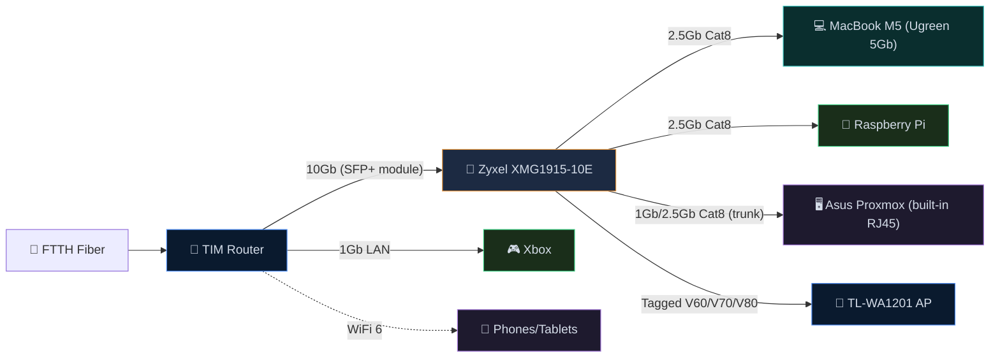

لیست کابل‌های مورد نیاز هم از این قراره (فاصله‌ها تخمینین):

| Cable | From → To | Category | Length | Speed |
|-------|-----------|----------|--------|-------|
| A | MacBook M5 (Ugreen 5Gb USB-C, owned) → Switch | Cat8 | 1-2m | 2.5Gb (switch caps) |
| B | Xbox → TIM Router (direct) | Cat8 | 0.5-1m | 1Gb |
| C | TIM Router 10Gb → Zyxel SFP+ #1 (via 10Gtek module) | Cat8 | 0.5-1m | 10Gb |
| D | Switch → Raspberry Pi | Cat6 | 0.5-1m | 1Gb (Pi max) |
| E | Switch → Asus Proxmox (built-in RJ45) | Cat8 | 0.5-1m | 1Gb (or 2.5Gb with future USB adapter) |
| F | Zyxel Port 4 → TL-WA1201 Guest AP | Cat8 | 1-1m | 1Gb |

### VLAN‌بندی و اتصال VLANها به کانتینرهای Proxmox

قبل از دیدن جدول VLANها، بد نیست خیلی کوتاه روشن کنم که چرا [Proxmox](https://www.proxmox.com/en/) در این طراحی این‌قدر مهمه. Proxmox در این‌جا نقش [hypervisor](https://en.wikipedia.org/wiki/Hypervisor) رو داره؛ یعنی بستری که VMها و [LXC](https://linuxcontainers.org/)ها روی آن اجرا می‌شوند. از طرف دیگر، VLANها شبکهٔ فیزیکی خونه را به چند شبکهٔ منطقی جدا از هم تقسیم می‌کنند. ترکیب این دو باعث میشه هر سرویس دقیقاً در شبکهٔ خودش قرار بگیره: مثلاً media stack در VLAN 20، محیط تحلیل بدافزار در VLAN 30 و محیط ناشناس در VLAN 50. در نتیجه، هم مدیریت ساده‌تر می‌شه، هم اگر در یکی از بخش‌ها مشکلی پیش بیاید، لزوماً به بقیهٔ زیرساخت سرایت نمی‌کنه.

در Proxmox این جداسازی معمولاً با [Linux Bridge](https://wiki.linuxfoundation.org/networking/bridge)های جداگانه یا sub-interfaceهای مبتنی بر VLAN انجام می‌شه. یعنی هر VM یا container فقط به bridge مربوط به خودش وصل میشه و از همون مسیر به subnet خودش دسترسی می‌گیره. این همون چیزیه که اجازه می‌ده مثلاً یک ماشین تحلیل بدافزار هیچ مسیر مستقیمی به شبکهٔ اصلی خانه نداشته باشه، یا سرویس‌های دانلود فقط از مسیر VPN به اینترنت برسن.

| VLAN ID | Name | Subnet | Purpose | Internet Access | Who Can Reach It |
|---------|------|--------|---------|-----------------|-----------------|
| 1 | Home | 192.168.1.0/24 | Your personal devices | Full (TIM router) | All your devices |
| 20 | Media | 192.168.20.0/24 | Torrents + [Jellyfin](https://jellyfin.org/) | VPN only ([Surfshark](https://surfshark.com/)) | VLAN 1 can reach Jellyfin |
| 30 | Malware Lab | 192.168.30.0/24 | [REMnux](https://remnux.org/), [FlareVM](https://github.com/mandiant/flare-vm), [INetSim](https://www.inetsim.org/) | **NONE** (air-gapped) | Nothing. Fully isolated. |
| 40 | Dev | 192.168.40.0/24 | [k3s](https://k3s.io/) cluster, testing | Internet for pulling images | VLAN 1 can reach k3s API |
| 50 | Anonymous | 192.168.50.0/24 | [Whonix](https://www.whonix.org/) + [Tor](https://www.torproject.org/) | VPN → Tor only | Nothing. Fully isolated. |
| 60 | Guest | 192.168.60.0/24 | Guest WiFi | Internet only (throttled) | Nothing internal. Monitored. |
| 70 | Qubes | 192.168.70.0/24 | Dedicated [Qubes OS](https://www.qubes-os.org/) laptop | Internet (VPN+Tor inside Qubes) | Nothing. Fully isolated. |
| 80 | IoT | 192.168.80.0/24 | Xiaomi vacuum, smart devices | Internet only (cloud control) | Nothing internal. Monitored. |

شماتیک نحوه‌ی اتصال بریج‌های کانتینر‌های Proxmox به VLANها:

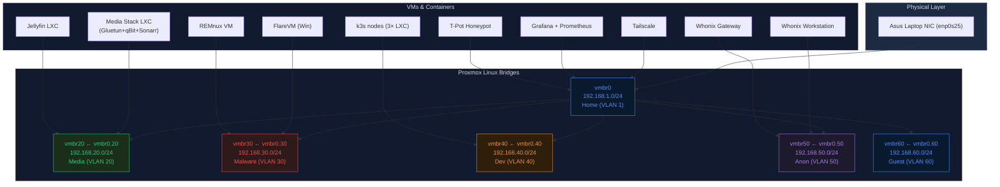

### media stack از تورنت تا چیزی شبیه نت‌فلیکس

یکی از بخش‌هایی که برای من از اول خیلی جذاب بود، ساختن یک media stack درست و حسابی بود. یعنی سیستمی که از مرحله‌ی پیدا کردن محتوا شروع کنه، فایل‌ها رو دانلود کنه، مرتب و دسته‌بندی‌شون کنه، اگر لازم بود زیرنویس مناسب پیدا کنه و در نهایت همه‌چیز رو توی یک پنل مرتب به نمایش بذاره؛ چیزی شبیه تجربه‌ای که آدم از نت‌فلیکس می‌گیره، با این تفاوت که این‌بار همه‌چیز روی زیرساخت خودم اجرا می‌شه. 

در این طراحی، کل این زیرسیستم داخل `VLAN 20` قرار می‌گیره. دلیلش هم روشنه: این بخش هم به بیرون شبکه وصل می‌شه، هم با تورنت سر و کار داره، هم قرار نیست با بقیه‌ی قسمت‌های حساس خونه قاطی بشه. برای همین منطقی‌تره که از همان ابتدا در یک زیرشبکه‌ی جدا قرار بگیره تا هم کنترلش راحت‌تر باشه، هم اگر روزی مشکلی پیش اومد، دامنه‌ی اثرش به بقیه‌ی شبکه نرسه. 

مرکز این بخش، [qBittorrent](https://www.qbittorrent.org/)ـه. این همون سرویسیه که دانلود تورنت‌ها رو انجام می‌ده. ولی نکته‌ی مهم اینه که من نمی‌خوام این برنامه به‌صورت مستقیم به اینترنت وصل بشه. برای همین توی این معماری، qBittorrent به‌جای این‌که شبکه‌ی مستقل خودش رو داشته باشه، از شبکه‌ی [Gluetun](https://github.com/qdm12/gluetun) استفاده می‌کنه. Gluetun یک کانتینر واسطه‌ست که تونل VPN رو بالا میاره و ترافیک بقیه‌ی سرویس‌ها رو از داخل همون تونل عبور می‌ده. نتیجه اینه که qBittorrent اساساً هیچ مسیر مستقیمی به اینترنت واقعی نداره و فقط از طریق VPN می‌تونه بیرون بره. اگر VPN قطع بشه، برنامه fallback نمی‌کنه که برگرده روی IP اصلی خونه؛ بلکه عملاً هیچ راهی برای بیرون رفتن نداره. همین باعث می‌شه این بخش از نظر نشت IP خیلی مطمئن‌تر از حالت‌های معمول باشه. این رفتار به‌خاطر استفاده از [`network_mode: service:gluetun`](https://docs.docker.com/compose/how-tos/networking/#use-a-pre-existing-network) در Docker هست — یعنی qBittorrent هیچ [network interface](https://en.wikipedia.org/wiki/Network_interface_controller) مستقلی نداره و فقط از طریق namespace شبکه‌ی Gluetun به اینترنت دسترسی داره.

برای خود VPN هم در این طرح، از [Surfshark VPN](https://surfshark.com/) و [WireGuard](https://www.wireguard.com/) استفاده شده. یعنی Gluetun تونل رو به سرور VPN بالا میاره و تمام ترافیک تورنت از همون مسیر خارج می‌شه. در عمل، peerهایی که در شبکه‌ی [BitTorrent](https://en.wikipedia.org/wiki/BitTorrent) باهاشون ارتباط برقرار می‌شه، IP واقعی اینترنت خونگی من رو نمی‌بینن و فقط IP خروجی VPN رو خواهند دید. این دقیقاً همان چیزی بود که برای این زیرسیستم لازم داشتم: تورنت، ولی نه به هر قیمتی. 

اما فقط دانلود کردن کافی نیست. اگر قرار باشه هر بار دستی بگردی، فایل بگیری، اسمش رو عوض کنی، جابه‌جاش کنی و بعد تازه بری دنبالش که کجا افتاده، کل این ماجرا خیلی زود خسته‌کننده می‌شه. این‌جا پای ابزارهای دیگه وسط میاد: [Prowlarr](https://prowlarr.com/)، [Sonarr](https://sonarr.tv/)، [Radarr](https://radarr.video/) و [Bazarr](https://www.bazarr.media/).

[Prowlarr](https://prowlarr.com/) وظیفه‌ی مدیریت indexerها رو داره؛ یعنی همان منابعی که قرار است از طریق آن‌ها تورنت‌ها پیدا شوند. [Sonarr](https://sonarr.tv/) برای سریال‌هاست، [Radarr](https://radarr.video/) برای فیلم‌ها و [Bazarr](https://www.bazarr.media/) هم برای زیرنویس. ایده اینه که من مشخص کنم چه فیلم یا سریالی رو می‌خوام، و بعد بقیه‌ی کارها تا حد زیادی خودکار انجام بشه: جست‌وجو، انتخاب نسخه‌ی مناسب، فرستادن به qBittorrent برای دانلود، مرتب‌سازی فایل‌ها و حتی پیدا کردن زیرنویس.  

از نظر ذخیره‌سازی هم قرار نیست این فایل‌ها پراکنده باشند. مسیر کلی کار به این صورته که qBittorrent فایل‌ها رو دانلود می‌کنه، Sonarr و Radarr بعد از کامل شدن دانلود، اون‌ها رو rename و organize می‌کنن و در پوشه‌های مناسب فیلم و سریال قرار می‌دن، و بعد [Jellyfin](https://jellyfin.org/) همون کتابخانه‌ی مرتب‌شده رو می‌خونه. یعنی در نهایت، به‌جای این‌که با فولدرهای درهم و برهم طرف باشم، یک آرشیو مرتب و ساخت‌یافته دارم که هر سرویس نقش خودش رو در ساختنش بازی کرده. 

لایه‌ی نهایی این بخش، [Jellyfin](https://jellyfin.org/)ـه؛ همون چیزی که عملاً این stack رو به چیزی شبیه نت‌فلیکس تبدیل می‌کنه. Jellyfin یک media server متن‌بازه که فایل‌های فیلم و سریال رو index می‌کنه، metadata و پوستر می‌گیره، کتابخانه رو مرتب نشون می‌ده و امکان استریم روی مرورگر، موبایل، تبلت و تلویزیون رو فراهم می‌کنه. یعنی خروجی نهایی این زیرساخت این نیست که یک‌سری فایل ویدئویی گوشه‌ی هارد داشته باشم؛ بلکه یک پنل مرتب و خوش‌قیافه دارم که محتوا رو مثل یک سرویس استریم واقعی نمایش می‌ده. از این جهت، ایده‌ی «نت‌فلیکس خانگی» دقیقاً همین‌جاست: نه فقط ذخیره‌سازی فیلم، بلکه ساختن یک تجربه‌ی مصرف محتوا که تا حد ممکن مرتب، متمرکز و راحت باشه. 

برای دسترسی داخل خونه، دستگاه‌های خودم که روی شبکه‌ی اصلی هستند می‌تونن به Jellyfin وصل بشن. ولی برای دسترسی از بیرون خونه، نمی‌خواستم برم سراغ port forwarding مستقیم و باز کردن پورت روی روتر. هم از نظر امنیتی خوشم نمیاد، هم حس می‌کنم برای این سناریو راه‌حل ساده‌تری وجود داره. برای همین در این بخش از [Cloudflare Tunnel](https://developers.cloudflare.com/cloudflare-one/networks/connectors/cloudflare-tunnel/) و [Cloudflare Zero Trust](https://www.cloudflare.com/learning/security/glossary/what-is-zero-trust/) استفاده می‌کنم. ایده اینه که به‌جای این‌که سرویس از اینترنت مستقیماً روی IP خونه در دسترس باشه، یک تونل خروجی از داخل شبکه‌ی خودم به Cloudflare برقرار بشه و Cloudflare نقش دروازه‌ی دسترسی رو بازی کنه. در این حالت، من لازم نیست برای Jellyfin یا پنل‌های مشابه، روی روتر پورت باز کنم.  

خود Zero Trust هم برای اینه که هر کسی نتونه صرفاً با داشتن آدرس سرویس، واردش بشه. قبل از رسیدن به خود Jellyfin، کاربر باید در لایه‌ی Cloudflare احراز هویت بشه؛ مثلاً با ایمیل یا روش‌های کنترلی دیگه. این‌طوری می‌تونم دسترسی رو فقط به آدم‌هایی بدم که خودم می‌خوام؛ مثلاً اعضای خانواده یا چند دوست نزدیک. مزیتش اینه که برای کاربر نهایی هم ماجرا ساده می‌مونه: به‌جای این‌که بخوام برای همه VPN راه بندازم یا تنظیمات پیچیده بدم، می‌شه دسترسی رو با یک URL کنترل‌شده و احراز هویت‌شده فراهم کرد. 

### نظارت بر شبکه‌ی مهمان و IoT: چی لاگ می‌شه و چطور

یکی از دلایلی که شبکه‌ی مهمان (VLAN 60) و IoT (VLAN 80) رو از شبکه‌ی اصلی جدا کردم، صرفاً امنیت نبود — می‌خواستم بتونم دقیقاً ببینم دستگاه‌هایی که به شبکه‌م وصل می‌شن چه‌کار می‌کنن. مخصوصاً دستگاه‌های IoT مثل جاروبرقی Xiaomi که معروف‌اند به [phone home](https://en.wikipedia.org/wiki/Phoning_home) کردن به سرورهای چینی.

ابزار اصلی برای این کار [ntopng](https://www.ntopng.org/) هست که روی Proxmox اجرا می‌شه و ترافیک رو روی اینترفیس‌های `vmbr60` (مهمان) و `vmbr80` (IoT) capture می‌کنه. ntopng یک ابزار مانیتورینگ ترافیک شبکه‌ست که [deep packet inspection](https://en.wikipedia.org/wiki/Deep_packet_inspection) انجام می‌ده و اطلاعات زیر رو برای هر دستگاه متصل نشون می‌ده:

- **هویت دستگاه:** آدرس IP، [MAC address](https://en.wikipedia.org/wiki/MAC_address)، hostname، سیستم‌عامل (از روی fingerprint)، و vendor (سازنده) — مثلاً می‌فهمی که فلان دستگاه یک iPhone اپله یا یک Xiaomi
- **پهنای باند:** میزان ترافیک ارسالی و دریافتی هر دستگاه در لحظه و در طول زمان
- **جریان‌های شبکه (flows):** هر اتصال source → destination با پروتکل، تعداد بایت‌ها، مدت زمان و timestamp
- **سایت‌های بازدید شده:** از روی DNS query و flow data
- **تشخیص ناهنجاری:** رفتارهای مشکوک مثل اسکن پورت، ترافیک غیرعادی، یا اتصال به IPهای مشکوک

علاوه بر ntopng، [AdGuard Home](https://adguard.com/en/adguard-home/overview.html) هم نقش مکملی داره. اگر DNS دستگاه‌های مهمان و IoT رو به AdGuard ست کنم (از طریق DHCP)، تمام [DNS query](https://www.cloudflare.com/learning/dns/what-is-dns/)های هر دستگاه هم لاگ می‌شه. این‌طوری نه‌تنها می‌بینم که مهمان یا جاروبرقی چقدر ترافیک تولید می‌کنه، بلکه دقیقاً می‌دونم به چه دامنه‌هایی درخواست DNS می‌زنه — و آیا اون درخواست بلاک شده یا نه.

در عمل، ترکیب این‌ها به من امکان می‌ده که مثلاً ببینم جاروبرقی Xiaomi هر ۳۰ ثانیه یک‌بار به `ot.io.mi.com` و `de.api.io.mi.com` (سرورهای ابری Xiaomi) وصل می‌شه، چقدر داده ارسال می‌کنه، و آیا به جایی وصل می‌شه که نباید. مهمان‌ها هم به طور مشابه: می‌تونم ببینم هر مهمان چقدر bandwidth مصرف کرده، به کجاها رفته، و آیا رفتار مشکوکی داره یا نه — البته بدون این‌که محتوای رمزنگاری‌شده (HTTPS) قابل دیدن باشه.

### سازوکار پرایوسی و عدم افشای هویت در سه زیر‌سیستم

این بخش برای من یکی از مهم‌ترین قسمت‌های طراحه، چون فان‌ترین بخش ماجراست :) ما در این بخش سه سناریوی مجزا داریم:

- یک سناریوی «privacy for use» برای media stack.
- یک سناریوی «anonymous browsing» با [Whonix](https://www.whonix.org/).
- یک سناریوی سخت‌گیرانه‌تر برای [Qubes OS](https://www.qubes-os.org/). 

این سه تا از نظر هدف، سطح تهدید و میزان ایزوله‌سازی یکسان نیستن؛ بنابراین نباید همه رو با یک متر یک‌سان سنجید. چیزی که در media VLAN لازم است، بیشتر جلوگیری از نشت IP موقع SEED/LEECH کردن تورنته. اما در Whonix و Qubes، بحث فراتر از صرفاً پنهان کردن IP می‌ره و به جداسازی هویت، محدود کردن مسیرهای خروجی و کاهش سطح اعتماد به کل سیستم می‌رسه.
قبل از این‌که به جزئیات بپردازم، این نکته رو بگم: گزینه‌های امن‌تر و مبتنی بر حریم‌شخصی بهتری مثل [Mullvad VPN](https://mullvad.net/en) بود ولی به‌دلیل این‌که هنوز اشتراک بلند‌مدت از [Surfshark](https://surfshark.com/) رو داشتم، و کل این ماجرا اساسا برپای تفریح و «باحال بودن» بود ترجیح دادم بودجه‌م رو صرف این کار نکنم و از همین VPNهایی که دارم استفاده کنم. ضمن این که، بخش اصلی ماجرا به دوش [Tor](https://www.torproject.org/)ـه.

همون‌طور که در ابتدای این بخش توضیح دادم، ما سه زیر مجموعه داریم. یک زیرمجموعه که مرتبط با مدیاست، برای دانلود فیلم‌ها و سریال‌ها از تورنت استفاده می‌کنه. از اون‌جایی که استفاده از تورنت بدون VPN چندان کار عاقلانه‌ای نیست نیازه که به نحوی امن از VPN استفاده کنیم و طوری ساختار رو پیاده کنیم که تضمین بشه تورنت، هیچ‌وقت بدون وصل شدن VPN انجام نشه. 

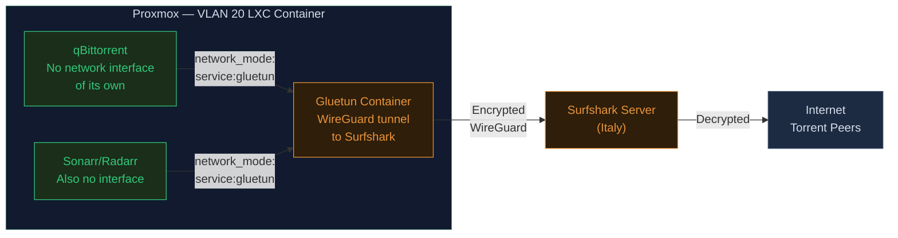

قضیه این نیست که qBittorrent (در صورت قطعی VPN) بخواد به IP واقعی برگرده یا اصطلاحاً Fall back کنه. این برنامه اساساً هیچ IP واقعی‌ای نداره! هیچ اینترفیس شبکه‌ای به جز تونل Gluetun بهش داده نشده. اگه تونل قطع بشه، اتصال qBittorrent به شبکه مطلقاً صفر می‌شه. از لحاظ معماری، این ستاپ کاملاً ضد نشت (leak-proof) طراحی شده؛ چون اصلاً اینترفیسِ دیگه‌ای وجود نداره که دیتایی بخواد ازش نشت کنه.

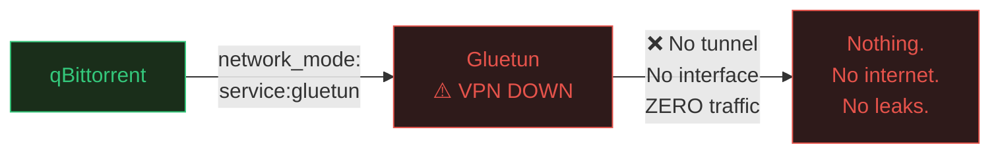

از طرفی VPN تنها برای این مورد استفاده نمیشه. در زیر بخش‌های حریم خصوصی، در لایه‌ی اول، از VPN استفاده‌ می‌کنند. و در ادامه درخواست‌ها از طریق [Tor](https://www.torproject.org/) یا [I2P](https://geti2p.net/en/) به اینترنت می‌رسه. این‌طوری ISP متوجه استفاده از Tor نمیشه و تنها ترافیک رمزنگاری شده با VPN رو می‌بینه. تفاوت بین این دو رو [اینجا](https://windscribe.com/blog/i2p-vs-tor/) می‌تونین بخونین.

```mermaid
graph LR
  subgraph VLAN50["Proxmox — VLAN 50"]
    WS["Whonix Workstation<br/>Your anon desktop<br/>No direct internet"]
    GW["Whonix Gateway<br/>Only VM with<br/>internet access"]
    WS -->|"Internal network<br/>only (vmbr50)"| GW
  end

  GW -->|"WireGuard"| VPN["Surfshark VPN<br/>(future: Mullvad<br/>cash-paid)"]
  VPN -->|"Encrypted"| GUARD["Tor Guard Node<br/>(Entry relay)"]
  GUARD -->|"Encrypted"| MIDDLE["Tor Middle Node<br/>(Relay)"]
  MIDDLE -->|"Encrypted"| EXIT["Tor Exit Node"]
  EXIT -->|"Decrypted"| DEST["Destination<br/>Website"]

  style VLAN50 fill:#111a2e,stroke:#a87bdf55,color:#d4dce8
  style WS fill:#1e1a2e,stroke:#a87bdf,color:#a87bdf
  style GW fill:#1e1a2e,stroke:#a87bdf,color:#a87bdf
  style VPN fill:#2e1e0a,stroke:#e8943a,color:#e8943a
  style GUARD fill:#2e1a1a,stroke:#e5534b,color:#e5534b
  style MIDDLE fill:#2e1a1a,stroke:#e5534b,color:#e5534b
  style EXIT fill:#2e1a1a,stroke:#e5534b,color:#e5534b
  style DEST fill:#1c2a42,stroke:#3d4f68,color:#d4dce8
```

تنظیمات شبکه‌ی Workstation فقط و فقط یه گیت‌وی (Gateway) رو می‌شناسه: `IP `10.152.152.10 (یعنی همون [Whonix Gateway](https://www.whonix.org/wiki/Whonix-Gateway)). این ماشین هیچ route یا مسیری به `192.168.1.1` (روتر TIM) و هیچ IP پابلیک دیگه‌ای نداره. حتی اگه یه بدافزار روی ورک‌استیشن اجرا بشه و تلاش کنه تا IP رو پیدا کنه، نهایتاً فقط می‌تونه به همون گیت‌وی برسه، که اونم چیزی جز یه مدار تور ([Tor circuit](https://tb-manual.torproject.org/about/)) رو در اختیارش نمی‌ذاره. در نتیجه، اون بدافزار به جای IP واقعیِ، فقط یه IP مربوط به شبکه Tor رو می‌بینه.

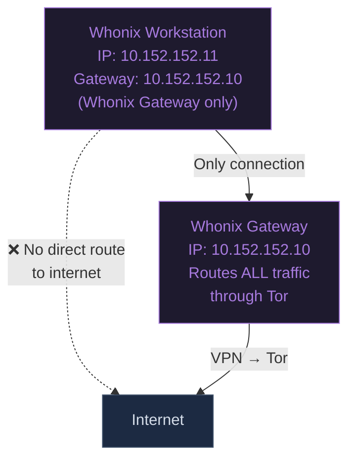

در حالت سوم که حداکثر پرایوسی در نظر گرفته شده و از سیستم‌عامل [Qubes OS](https://www.qubes-os.org/) استفاده شده، سیستم بر این مبنا کار می‌کنه:


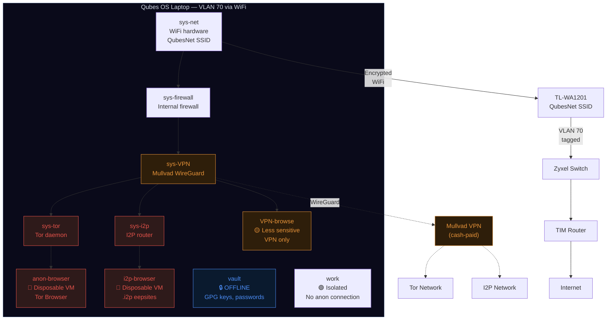

مسیر Routing در Qubes به این صورته:

زنجیره اول: وب‌گردی ناشناس مبتنی بر [Tor](https://www.torproject.org/)
```
anon-browser → sys-tor → sys-VPN → sys-firewall → sys-net → WiFi → VLAN 70 → Internet
         ↓      ↓
       Tor encrypts  Mullvad encrypts
       (3 layers)   (WireGuard)
```

زنجیره دوم: [I2P](https://geti2p.net/en/) Network Access

```
i2p-browser → sys-i2p → sys-VPN → sys-firewall → sys-net → WiFi → VLAN 70 → Internet
         ↓      ↓
       I2P garlic  Mullvad encrypts
       routing    (WireGuard)
```

و زنجیره‌ی سوم، مبتنی بر VPN تنها:

```
VPN-browse → sys-VPN → sys-firewall → sys-net → WiFi → VLAN 70 → Internet
        ↓
      Mullvad encrypts
      (WireGuard)
```

در نهایت، مقایسه‌ای از رفتار این زیر سه‌بخش و میزان observability در هر کدوم رو بررسی می‌کنیم:

```mermaid
graph TD
  subgraph MEDIA["VLAN 20 — Media Stack"]
    M1["qBittorrent"] --> M2["Gluetun VPN"]
    M2 --> M3["Surfshark"]
    M3 --> M4["Internet"]
  end

  subgraph WHONIX["VLAN 50 — Whonix"]
    W1["Workstation"] --> W2["Gateway"]
    W2 --> W3["Surfshark VPN"]
    W3 --> W4["Tor (3 relays)"]
    W4 --> W5["Internet"]
  end

  subgraph QUBESOS["VLAN 70 — Qubes OS"]
    Q1["Disposable VM"] --> Q2["sys-tor"]
    Q2 --> Q3["sys-VPN (Mullvad)"]
    Q3 --> Q4["Tor (3 relays)"]
    Q4 --> Q5["Internet"]
  end

  style MEDIA fill:#1a2e1a,stroke:#34c77b,color:#d4dce8
  style WHONIX fill:#1e1a2e,stroke:#a87bdf,color:#d4dce8
  style QUBESOS fill:#0a1a2e,stroke:#4d8ef7,color:#d4dce8
```

| | Media (VLAN 20) | Whonix (VLAN 50) | Qubes (VLAN 70) |
|--|----------------|------------------|-----------------|
| **Purpose** | Hide torrents from ISP | Anonymous browsing | Maximum compartmentalized privacy |
| **Encryption layers** | 1 (VPN) | 4 (VPN + 3 Tor) | 4+ (VPN + Tor/I2P + [Xen](https://xenproject.org/) isolation) |
| **ISP sees** | VPN traffic | VPN traffic | VPN traffic |
| **VPN sees** | Torrent traffic | Tor traffic | Tor/I2P traffic |
| **Destination sees** | Surfshark IP | Tor exit IP | Tor exit IP |
| **Leak protection** | Container binding (no interface) | Gateway forces all through Tor | Xen hardware isolation + disposable VMs |
| **If browser compromised** | N/A (no browser) | Attacker sees Tor IP, not real IP | Attacker trapped in disposable VM, destroyed on close |
| **Identity separation** | Surfshark knows your payment | Surfshark knows your payment (for now) | Mullvad doesn't know who you are (cash-paid) |
| **Kill switch** | Architectural (no interface) | Gateway-enforced (Workstation has no route) | [Xen](https://xenproject.org/)-enforced (VM has no route except through chain) |
| **Best for** | Downloading media privately | Sensitive research, [.onion](https://en.wikipedia.org/wiki/.onion) sites | Whistleblowing, journalism, max OpSec |

### بخش نظارت و مانیتورینگ

همون‌طور که قبل‌تر در بخش مانیتورینگ رزبری توضیح دادم، ترکیب [Prometheus](https://prometheus.io/) + [Grafana](https://grafana.com/) + [node_exporter](https://github.com/prometheus/node_exporter) + [cAdvisor](https://github.com/google/cadvisor) پایه‌ی مانیتورینگ من هست. حالا با اضافه شدن Proxmox و VLANهای بیشتر، این stack گسترش پیدا می‌کنه. [ntopng](https://www.ntopng.org/) برای ترافیک شبکه اضافه می‌شه، [CrowdSec](https://www.crowdsec.net/) برای تشخیص حملات و [InfluxDB](https://www.influxdata.com/) به عنوان ذخیره‌ساز داده‌های flow از ntopng.

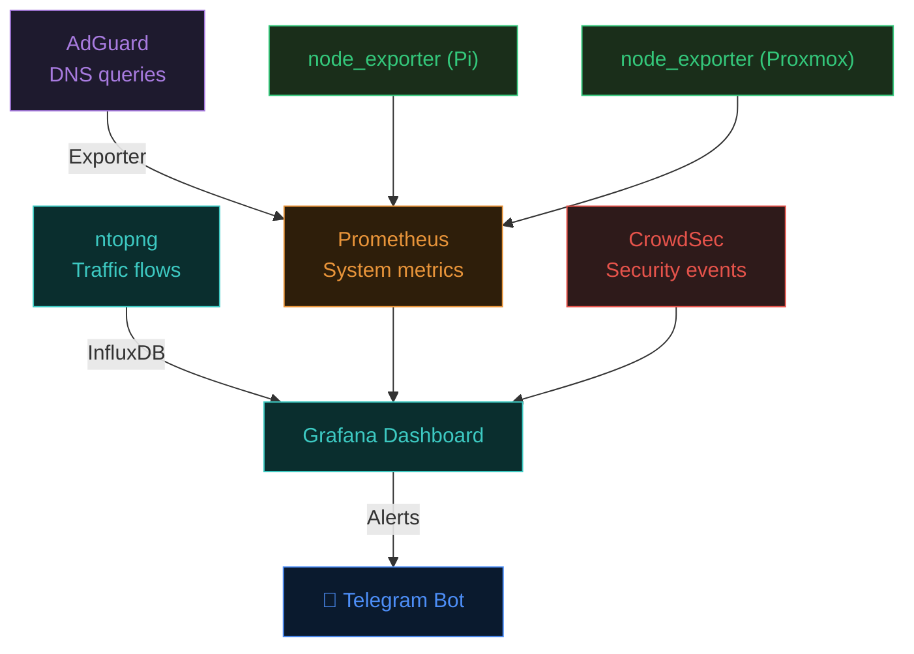

نوتیفیکیشن‌ها هم از طریق یک بات تلگرام ارسال می‌شن. مواردی مثل: افت VPN، پر شدن دیسک، تشخیص حمله توسط [CrowdSec](https://www.crowdsec.net/)، اتصال مهمان جدید، تلاش ناموفق لاگین SSH و از دسترس خارج شدن سرویس‌ها. راه‌اندازی بات هم ساده‌ست: ساخت بات از طریق [@BotFather](https://t.me/BotFather) در تلگرام، گرفتن chat_id و تنظیمش به عنوان Contact Point در Grafana Alerting.


من سعی کردم تا اینجا، تمام مواردی که توی طراحی homelab به‌نظر مهم بود رو بنویسم. نوشتن این پست واقعا زمان زیادی برد و به نظرم تا همین‌جا کافیه. می‌دونم، کلی جزئیات هست که میشه بهش پرداخت ولی فکر می‌کنم که این‌ها رو موکول کنم به زمان دیگه. ممنونم که تا اینجا خوندین و دنبال کردین. سعی می‌کنم که آپدیت کنم وضعیت ساخت آزمایشگاه رو توی بلاگ. خیلی هم خوش حال میشم اگر کسی از دوستان که دستی بر آتش داره، و نظری برای بهتر شدن این معماری داشت یا اصلا نکته‌ای داشت، ممنون میشم به من ایمیل بزنه. 

ارادتمند،
علیرضا
ساعت ۳ صبح پنج‌شنبه ۱۶ آوریل.