It's probably been a few years that I've had the idea of setting up a home computer lab (a homelab), but the conditions were never right. Either I was caught up in school and university, which meant I wasn't home. Or the financial means weren't there. Or I simply didn't have the motivation, and my weakness in properly understanding networking — due to lack of hands-on experience — kept me from pursuing that very hands-on experience. It was as if I was trapped in a vicious cycle. Out of fear of not knowing enough, I never took the step to experience and learn.

Now, after several years, after passing courses like "Computer Networks," "Network Lab," "Network Security," and reading parts of the book [Computer Networking: A Top-Down Approach by Kurose and Ross](https://www.goodreads.com/book/show/83847.Computer_Networking) during my bachelor's, and the "Computer Security" course during my master's, and of course the small practical experiences born out of curiosity and the necessity of being Iranian (yes, I mean internet filtering), and finally finishing the exhausting game of higher education, with access to stable internet at home (here I got a 10Gb FTTH connection from the TIM operator, at a monthly price of 30 euros, which seems genuinely cheap to me) — there was no longer any excuse not to keep myself busy with this.

A large part of this post covers the work I started two years ago. I think it's useful to explain where this story began and what path it took. I'll say a bit about the current state of my home network, and then move on to the network expansion plan.

### The Starting Point: Putting an Idle External Hard Drive to Work

In 2017, the night before I packed my things and left for Shahrood, I wanted to transfer part of my music archive from the home desktop's hard drives to my laptop — an archive I'd built up during middle and high school on an ADSL connection. I had just bought the laptop those same days: an [Asus K556UQ](https://kelaptop.com/en/asus-k556uq-dm801d-k556uq-dm801d). A laptop that was finally retired three years ago after around 6–7 years of service, when I bought a MacBook Pro M2. Though it doesn't seem like the retirement will last long :) I'll talk about it later. Let's not get off track! It was the last night of the week. A lot of shops were closed. I rushed over to Taghavi Passage. The shop at the far end of the ground floor was still open. I hadn't had much chance to research hard drives beforehand, so I asked the seller to recommend a good 1TB external hard drive. He suggested the [Transcend StoreJet 25H3](https://it.transcend-info.com/product/external-hard-drive/storejet-25h3). He gave me some explanations about its low failure rate and what drive was inside it, and eventually I decided to go with it. The price? 160,000 tomans :) At the time, the dollar was around 4,000 tomans…


Now, after several years, after coming to Milan and using Google Drive and iCloud, I essentially had no need to use the external hard drive. Everything is stored on the cloud and accessible from anywhere. But that wasn't something I was happy with. The geeky side of my personality wanted to hook up this hard drive and put it to work, and what better than being able to use it like a NAS (I know that a [NAS](https://en.wikipedia.org/wiki/Network-attached_storage) has conditions and features that can't be replicated with just this hard drive alone. I've framed it this way for simplicity and due to the similarity). I wanted to use this hard drive as an encrypted drive using [VeraCrypt](https://en.wikipedia.org/wiki/VeraCrypt) and transfer files I wanted onto it over the network. To do this, I needed a device I could connect the hard drive to, install VeraCrypt on, and share the drive over the network via some protocol….


### The Beginning of a Beginning: Buying a Raspberry Pi 5

I usually fall in love with a tool and then dig a hole for it — an excuse to use the tool I want. The story of buying the Pi was the same :) I'd had plans before to buy a Raspberry Pi and needed a scenario in which to use it. One of those scenarios was exactly this NAS situation, and I wasn't only satisfied with that. I had bigger plans for it :) So I got the [Raspberry Pi 5 **8GB** RAM Starter Kit](https://www.robotstore.it/en/Raspberry-Pi-5-8GB-Starter-Kit). This kit included the following items:

- Raspberry Pi 5 board, 8GB RAM model
- White and red case with fan
- 24W adapter

On the router, I assigned a static IP of `192.168.1.10` to the Pi (if I hadn't done this, every time the router restarted, it could assign a new IP to the Pi, and I'd have to update the Pi's IP on every other device I was using it from — which is not at all pleasant). Now I could connect the hard drive to the Pi and, after encryption, share it over the network via [SMB](https://en.wikipedia.org/wiki/Server_Message_Block).


Around that same time, I decided to use this opportunity to run some Telegram bots I had written on it. One of the bots I wrote that was very useful in the first year or two of being in Milan — both for myself and for others — was a bot for building 5-euro shopping baskets (the value of Mensa tickets). Even though this bot is no longer useful, I'd like to write a bit about it.

#### The Classic Knapsack Problem: A Bot for Optimal Spending of Mensa Tickets

Students who study in Italy with the [DSU regional scholarship](http://polimi.it/en/students/tuition-fees-scholarships-and-financial-aid/university-financial-aid-diritto-allo-studio-universitario-dsu) (specifically at Politecnico di Milano) receive a daily 5-euro shopping voucher. It's a small amount even for students, and so many of them would share their vouchers. For example, 4 people would give their day's vouchers to one member of the group to do their main shopping (things like chicken, rice, etc.). But there was one challenge: each voucher could only be used for one shopping basket and paid for in one transaction. For example, if the total came to 20 euros, the items had to be split into 4 different baskets, and each basket paid for with one of the codes. On the surface this doesn't seem like a problem, but the challenge is that items have various prices with up to two decimal places, and for students (with a euro worth 30 to 50 tomans at the time) even one euro mattered. So they had to arrange their shopping baskets such that the price of each basket was as close as possible to the voucher value (5 euros).


Optimally and quickly arranging these items in the chaos of the store and payment machines, while other Mensa group members waited for you to take their vouchers and a long line of people stood behind you, was no easy task. At least for me, it was stressful. So I wrote a bot that you could feed a list of items and prices, and it would distribute them across different shopping baskets in such a way that the price of each basket was the number closest to 5 euros. For example, in a scenario where you had 4 five-euro vouchers and your total came to 22 euros, in the optimal case you'd only need to pay 2 euros extra (since the 20-euro portion was covered by vouchers). This bot tried to find a permutation of items across different baskets such that the money you paid was as close as possible to 2 euros.

I first wrote this bot for myself, then gave it to my housemates, and then to the rest of my friends, which meant it needed to be up and running at all times. Now that I had the Pi, this was possible. A computer that's always on and consumes little power. I [Dockerized](https://www.docker.com/) the bot and put it in a [`docker-compose`](https://docs.docker.com/compose/) file so I could deploy or move it easily whenever I wanted. The bot was up for about a year or two, and then, because in the new system Mensa codes could be combined in a single basket, it was no longer needed and I took it down.

### Reducing the Nuisance of Ads: Setting Up a DNS-Level AdBlocker

One of my initial goals from the very beginning was to set up a [DNS](https://www.cloudflare.com/learning/dns/what-is-dns/) server that would let me block ads at the DNS level across all devices inside the network. Tools like [Pi-Hole](https://pi-hole.net/) and [AdGuard Home](https://adguard.com/en/adguard-home/overview.html) already existed for exactly this purpose. With the Pi, this was easily achievable. I chose AdGuard Home (though I might go and test Pi-Hole in the near future) and brought up its container on the Pi. Now I just needed to set `192.168.1.10` as the DNS in the settings of my devices. This way, DNS requests would reach the Pi and then AdGuard Home, and from there via [DoT (DNS over TLS)](https://www.cloudflare.com/learning/dns/dns-over-tls/) to [Adguard DNS](https://adguard-dns.io/en/welcome.html) servers (which filter advertising DNS queries). So not only were DNS requests encrypted and invisible to the ISP, but requests that reached ad servers also received incorrect answers. This way, ads in apps and websites couldn't load.


It was possible to simplify things so that anyone connecting to the home router wouldn't need to manually set the Pi's IP. AdGuard Home had a [DHCP Server](https://en.wikipedia.org/wiki/Dynamic_Host_Configuration_Protocol) capability. This way, instead of the router handing out IPs to network devices, AdGuard Home would do it. I used this for a while, but for unknown reasons (which I also didn't have much time to investigate) after every modem restart or new device connection, the IP assignment process would take several minutes. So I decided to go back to the manual approach.


### Monitoring and Various Services

Now that the number of services running on the Pi was growing, the opportunity arose to get some experience with [Grafana](https://grafana.com/docs/grafana/latest/visualizations/panels-visualizations/). For this purpose, four different services needed to be brought up:

- For monitoring Docker container status: [cAdvisor](https://github.com/google/cadvisor).
- For the system's own status such as RAM, CPU, IO usage, etc.: [node_exporter](https://github.com/prometheus/node_exporter).
- For displaying statistics and graphs: [Grafana](https://grafana.com/).
- And finally a database for storing logs: [Prometheus](https://prometheus.io/).

The general relationship between these three is that [node_exporter](https://github.com/prometheus/node_exporter) collects information from the host, and [cAdvisor](https://github.com/google/cadvisor) collects information from containers and stores it in Prometheus's time-series database ([TSDB](https://en.wikipedia.org/wiki/Time_series_database)) (both of these are Prometheus exporters). Grafana is a panel that can connect to a large number of databases including Prometheus and queries the data from it.

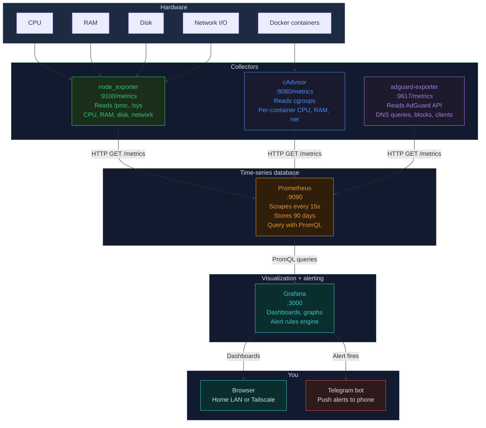

Doing this helped me get a bit more familiar with the Grafana panel itself and its capabilities. For example, since on some nights the Pi's fan noise had gotten louder, I added a new custom panel that could display the fan speed status with a qualitative scale. Or I read a bit more about Prometheus itself to learn more about [time-series](https://en.wikipedia.org/wiki/Time_series_database) databases.


### Being Iranian

From around 2022, the same year I came to Milan, the use of configs based on protocols like [VLESS](https://habr.com/en/articles/990144/), [VMess](https://xtls.github.io/en/development/protocols/vmess.html), and [Trojan](https://trojan-gfw.github.io/trojan/protocol.html) and similar ones had become very common. A whole lot of new terminology and concepts I'd never heard of had emerged. All of this was because the censorship situation in Iran was getting worse day by day, and a hundred different tricks were needed to circumvent [DPI](https://en.wikipedia.org/wiki/Deep_packet_inspection) and the great firewall and the like. Since all my friends and family were in Iran, I needed to keep them connected at all times. I always did this by purchasing various VPNs. For a long time, censorship could still be circumvented with VPNs like [Express VPN](https://www.expressvpn.com/), but this kind of complacency and taking the easy way out really wasn't something I was happy with. A whole lot of new concepts had appeared that I hadn't even heard the names of, and this ignorance was bothering me. This continued until we hit the [January 2026 uprising](https://fa.wikipedia.org/wiki/%D8%AE%DB%8C%D8%B2%D8%B4_%DB%B1%DB%B4%DB%B0%DB%B4_%D8%A7%DB%8C%D8%B1%D8%A7%D9%86). An uprising that began on January 7th and reached its bloodiest days on the 17th and 18th. A massacre so great that even being buried in the depths of history cannot wash away the blood that was shed.

In the Islamic Republic, everything is viewed through a security/political lens, and decisions are made accordingly. The internet was no exception to this rule. The internet, rather than being a vital infrastructure like electricity and water, had become a security matter and moved further day by day toward becoming a national intranet. For the first time in [November 2019](https://fa.wikipedia.org/wiki/%D8%A7%D8%B9%D8%AA%D8%B1%D8%A7%D8%B6%D8%A7%D8%AA_%D8%A2%D8%A8%D8%A7%D9%86_%DB%B1%DB%B3%DB%B9%DB%B8_%D8%A7%DB%8C%D8%B1%D8%A7%D9%86), when protests flared up over the overnight tripling of gasoline prices, the internet was completely cut off for an extended period for the very first time. I was in the dormitory those days, and I remember having no internet access for almost 10 days. With great difficulty and effort, I managed to get access to Telegram configs so I could at least follow the news on Telegram. The powers that be found this internet blackout sweet to their taste, and at every critical moment they resorted to cutting the internet.

This time, in January 2026, the same thing happened. The conventional VPNs no longer worked, and there was no choice but to use the new protocols. So I decided, in order to avoid using regular hosting providers, to bring the VPN server up on my home internet. Because hosting providers generally have specific IP ranges that are identified by the censorship apparatus, which could increase the risk of being filtered in some scenarios. For this purpose, I used the [3x-ui](https://github.com/MHSanaei/3x-ui) panel and brought up a container of it on the Pi. 3x-ui is a web interface built on top of the [Xray-core](https://github.com/xtls/xray-core) engine that allows creating different configs on different protocols. During the time I worked on this, I became more familiar with those new concepts I mentioned and was able to understand them better.
Alongside this panel, I also needed to use [cloudflare-ddns](https://github.com/timothymiller/cloudflare-ddns), and this is because of the [dynamic nature of home internet IPs](https://www.cloudflare.com/learning/dns/glossary/dynamic-dns/).
For reasons whose explanation would be long and off-topic, the server's IP had to be set in the DNS records of the [Cloudflare](https://www.cloudflare.com/) panel. Since the server was on my home internet's IP, and this could even change when the modem was restarted, all the configs I'd given to friends and family could break. So it was necessary for the Cloudflare panel to always be informed of my new IP. The job of cloudflare-ddns was exactly this. It periodically checked my IP and updated it in the Cloudflare panel. Though this situation only lasted for about a month…


One day when I logged into Instagram, an email arrived from Meta saying a new device from Tehran (!) had logged into my account. It didn't take more than a few seconds for the cause to become clear to me. The VPN server was behind everything! The situation was this: my friends living in Tehran, who were using the VPN server I'd set up at home, had Instagram. The Instagram app has general access to location via [GPS](https://ciechanow.ski/gps/). Meanwhile, they were connecting to the internet, including Instagram, through our home network. After a period of use, from Instagram's servers' perspective, the IP they were connecting with was from Milan, but their geographical location clearly showed they were living in Tehran. And apparently (and logically) the weight given to the actual physical location was greater than the IP, and our home internet's IP had been labeled Tehran. The situation wasn't limited to Meta either. About a day or two later I also noticed the same thing had happened with Google, and I could no longer access sections I used to visit, and it was telling me that such-and-such service is not supported in your country (Iran).


To fix the problem, I quickly transferred the entire container to an [OVH](https://www.ovhcloud.com/en/) server I already had. Now there was no need for ddns anymore, because [VPS](https://en.wikipedia.org/wiki/Virtual_private_server) servers have static IPs. I registered that in the panel and that was that. Of course, this situation also didn't last long. With the start of the US and Israel's war with Iran, the internet was cut off in a historically unprecedented way this time. Almost everyone inside Iran was disconnected except those who had [Starlink](https://www.starlink.com/) (and even now, after all this time, the situation remains dire). Even in the first two weeks from the 17th of Dey onward, the internet was cut like this. It was around then that the [dnstt](https://www.bamsoftware.com/software/dnstt/) method was introduced, which allowed data transmission inside DNS packets. Though after that period, it was again possible to connect to the internet with the old [V2Ray](https://www.v2ray.com/) configs. But this time, during the war, the conventional methods still don't work. An environment was prepared to implement tiered internet. Now the configs being sold at astronomical prices — multiple euros per gigabyte — are all for one of these so-called white servers or Starlink configs. Of course, it was a day or two ago that a series of foreign domains were unblocked again, and simultaneously the [SNI Spoofing](https://github.com/patterniha/SNI-Spoofing) method was made public by an unknown person, which spread very quickly among people and gave many the ability to connect to the global internet. Though today there was talk that they're trying to block this too. What these methods are and what they do — I'll leave that for another post. I just wanted, while talking about the censorship situation, to make this section as complete as possible. Moving on……

### Defining a Domain for Internal Services

One of the things that seemed logical and should have been done earlier was that instead of accessing various services (like the AdGuard panel or Grafana) by entering the Pi's IP and the service's port, I could access them via a domain. For example, instead of typing `192.168.1.10:3000` to open the AdGuard Home panel, I'd type `http://adguard.home` in the browser.

For this, I needed to do a few things:
- Converting a domain to an IP is the fundamental job of [DNS](https://www.cloudflare.com/learning/dns/what-is-dns/). That is, when we know a website's domain and want to reach its IP to connect to it, we ask for the address from a DNS server. To implement this scenario in the home network, I had to turn to our DNS server: AdGuard Home. In the panel, there's an option to define domains and create maps. I created maps for AdGuard, Grafana, and Prometheus services. But this alone isn't sufficient.


- For an HTTP request made to a domain to reach the desired container, we need to use a [reverse proxy](https://www.cloudflare.com/learning/cdn/glossary/reverse-proxy/). And I used [nginx](https://nginx.org/). The general way it works is that inside the AdGuard panel I map all the domains I want to the address `192.168.1.10`. At a higher layer, it's nginx that determines, based on the URL, which container the request should reach. This way I was able to achieve the goal I wanted. Below I'll include the `docker-compose.yml` file I'm currently using on the Pi, together with the nginx config.

docker-compose.yml

```yml
services:
 # --- Nginx (The Gateway) ---
 nginx:
  image: nginx:latest
  container_name: nginx_proxy
  restart: unless-stopped
  ports:
   - "80:80"
  volumes:
   -./nginx/nginx.conf:/etc/nginx/nginx.conf:ro
  depends_on:
   - grafana
   - prometheus
  networks:
   - internal_net

 # --- AdGuard Home (DNS & DHCP) ---
 # Note: Must use 'network_mode: host' to see real device IPs for DHCP
 adguard:
  image: adguard/adguardhome
  container_name: adguard
  restart: unless-stopped
  volumes:
   -./adguard/conf:/opt/adguardhome/conf
   -./adguard/work:/opt/adguardhome/work
  network_mode: host

 # --- Grafana (Visual Dashboard) ---
 grafana:
  image: grafana/grafana
  container_name: grafana
  restart: unless-stopped
  environment:
   - GF_SECURITY_ADMIN_PASSWORD=admin
   - GF_SERVER_ROOT_URL=http://grafana.home
   - GF_SERVER_DOMAIN=grafana.home
  volumes:
   - grafana_data:/var/lib/grafana
  networks:
   - internal_net

 # --- Prometheus (The Data Collector) ---
 prometheus:
  image: prom/prometheus
  container_name: prometheus
  restart: unless-stopped
  command:
   - '--config.file=/etc/prometheus/prometheus.yml'
   # Removed '--web.external-url' because we are now using a subdomain (prometheus.home)
  volumes:
   -./prometheus/prometheus.yml:/etc/prometheus/prometheus.yml
   - prometheus_data:/prometheus
  networks:
   - internal_net

 # --- cAdvisor (Docker Monitor) ---
 cAdvisor:
  image: gcr.io/cAdvisor/cAdvisor:latest
  container_name: cAdvisor
  restart: unless-stopped
  volumes:
   - /:/rootfs:ro
   - /var/run:/var/run:ro
   - /sys:/sys:ro
   - /var/lib/docker/:/var/lib/docker:ro
   - /dev/disk/:/dev/disk:ro
  devices:
   - /dev/kmsg
  networks:
   - internal_net

 # --- Node Exporter (System Monitor - ADDED THIS) ---
 node_exporter:
  image: prom/node-exporter:latest
  container_name: node_exporter
  restart: unless-stopped
  volumes:
   - /proc:/host/proc:ro
   - /sys:/host/sys:ro
   - /:/rootfs:ro
   -./node_exporter/textfiles:/var/lib/node_exporter/textfile_collector:ro
  command:
   - '--path.procfs=/host/proc'
   - '--path.rootfs=/rootfs'
   - '--path.sysfs=/host/sys'
   - '--collector.filesystem.mount-points-exclude=^/(sys|proc|dev|host|etc)($$|/)'
   - '--collector.textfile.directory=/var/lib/node_exporter/textfile_collector'
  networks:
   - internal_net

volumes:
 grafana_data:
 prometheus_data:

networks:
 internal_net:
  driver: bridge
````
nginx.conf

```nginx
user nginx;
worker_processes auto;

error_log /var/log/nginx/error.log notice;
pid /var/run/nginx.pid;

events
{
  worker_connections 1024;
}

http
{
  include /etc/nginx/mime.types;
  default_type application/octet-stream;

  log_format main '$remote_addr - $remote_user [$time_local] "$request" '
  '$status $body_bytes_sent "$http_referer" '
  '"$http_user_agent" "$http_x_forwarded_for"';

  access_log /var/log/nginx/access.log main;

  sendfile on;
  keepalive_timeout 65;

  # =========================================================
  # BLOCK 1: AdGuard Home
  # URL: http://adguard.home
  # =========================================================
  server
  {
    listen 80;
    server_name adguard.home;

    location /
    {
      proxy_pass http://192.168.1.10:3000/;

      proxy_set_header Host $host;
      proxy_set_header X-Real-IP $remote_addr;
      proxy_set_header X-Forwarded-For $proxy_add_x_forwarded_for;
      proxy_set_header X-Forwarded-Proto $scheme;

      proxy_http_version 1.1;
      proxy_set_header Upgrade $http_upgrade;
      proxy_set_header Connection "upgrade";
    }
  }

  # =========================================================
  # BLOCK 2: Grafana
  # URL: http://grafana.home
  # =========================================================
  server
  {
    listen 80;
    server_name grafana.home;

    location /
    {
      proxy_pass http://grafana:3000/;

      proxy_set_header Host $host;
      proxy_set_header X-Real-IP $remote_addr;
      proxy_set_header X-Forwarded-For $proxy_add_x_forwarded_for;
    }
  }

  # =========================================================
  # BLOCK 3: Prometheus
  # URL: http://prometheus.home
  # =========================================================
  server
  {
    listen 80;
    server_name prometheus.home;

    location /
    {
      proxy_pass http://prometheus:9090/;

      proxy_set_header Host $host;
      proxy_set_header X-Real-IP $remote_addr;
      proxy_set_header X-Forwarded-For $proxy_add_x_forwarded_for;
    }
  }
}
```

### Accessing the Home Network from Outside: VPN

From the very first day I wanted to be able to access the data on my external hard drive on the home network from anywhere outside the home as well. But I didn't feel a strong need for it until the day I wanted to be able to check the 3x-ui panel when I wasn't home. So I was looking for an easy way to set up a VPN. With a simple search, I came across [Tailscale](https://tailscale.com/).

To use Tailscale, you have to install a client on the devices you want. I installed one on the Pi, one on the laptop, and another on my phone. All these devices are connected to each other by logging into your account on Tailscale. For example, in my account, all my devices logged in with my credentials are accessible. Each one is given a 100-range IP, because now that we're connected to the VPN, we're inside the Tailscale network. Now when the VPN is connected, to SSH into the Pi, I can't enter the address `192.168.1.10` because we're no longer on the home network. We're on Tailscale's private network. The Pi now has, for example, IP `100.64.0.61` and is only reachable via this IP.

### Other Smaller Tasks and Side Notes

Throughout all these adventures, I did other smaller things too. To make the VPN server accessible from outside on the ports of the configs I was creating, I needed to do [port forwarding](https://en.wikipedia.org/wiki/Port_forwarding). The way it works is that in the router you configure it so that all requests arriving from the internet to the router, if they're on port `1361` (a hypothetical number), should be forwarded to the Pi device at IP `192.168.1.10`.
On the other hand, now that some ports were being opened on the router, I needed to configure the Pi's firewall — which was based on [UFW (Uncomplicated Firewall)](https://en.wikipedia.org/wiki/Uncomplicated_Firewall) — so that it only accepts requests on the specific ports I designated. Otherwise, it should [drop](https://en.wikipedia.org/wiki/Firewall_(computing)) the request.
Alongside these tasks, I fiddled a bit with [DMZ](https://en.wikipedia.org/wiki/DMZ_(computing)) — understanding what it does. I also played around a bit with [Fail2Ban](https://github.com/fail2ban/fail2ban). I tried to read the xray-core logs to see how far I could observe the requests of people connected to my VPN. And how much possibility there is for [spoofing](https://en.wikipedia.org/wiki/Spoofing_attack) or [intercept](https://blog.cloudflare.com/understanding-the-prevalence-of-web-traffic-interception/). Scenarios I played with a little bit purely out of curiosity.

I've told all these stories so we can see the evolutionary path of how this desire took shape. Now it seemed like the right time to expand on this. To experiment more and learn better and more.

### Requirements for a Homelab

From building such a lab, I was pursuing a few goals. Apart from learning and personal fantasies, I wanted this lab to have specific functions, each of which is described below:

- The home network must be divided into separate subnets, each used for a specific purpose.
- Creating an environment for testing software projects I implement, especially projects that need to be examined in distributed scenarios.
- Creating an isolated environment for testing and examining malware.
- Creating a media server, to build a Netflix-like panel and provide access to people I want from outside the home network.
- Creating a subnet that guarantees the ability to use torrents without the possibility of exposing the real IP address.
- Creating a secure and private environment for accessing the internet without revealing identity.
- Having a separate network for guests and monitoring and supervising traffic exchanged on this network.
- Creating a [honeypot](https://en.wikipedia.org/wiki/Honeypot_(computing)) for bots and attackers, and the ability to observe behaviors and intrusion attempts.
- Creating a network isolated from the home network for [IoT](https://en.wikipedia.org/wiki/Internet_of_things) devices.
- Having a completely separate system for anonymous web access (similar to the previous case but this time on a separate laptop with a privacy-based OS).
- Creating a separate network for devices like work or personal laptops, or mobile and tablet.
- Separate and independent internet access for Xbox.
- Access to network infrastructure from outside the home using VPN.
- Monitoring the status of infrastructure, networks, and services, and being able to receive notifications about network behavior via Telegram.

### High-Level Network Topology Design

From here on, the text relates to hypothetical plans and, generally, network assumptions. That is, everything you see in this section has not necessarily been implemented right now; rather, some of it is part of the homelab's development roadmap. It was important to me that the architecture be designed to be modular and extensible from the very beginning; so that later, if I add a new service, I don't have to rebuild the entire structure from scratch.

The main design idea is that each category of use cases should be placed in a separate part of the network: everyday and personal services, media stack, development environment, malware analysis lab, guest network, IoT network, and anonymous environment. This separation, in addition to security, is also useful from a troubleshooting and [observability](https://en.wikipedia.org/wiki/Observability_(software)) perspective, because traffic can be tracked more precisely.
The requirements were extensive. I tried to design an architecture for these requirements (based on creating [VLANs](https://en.wikipedia.org/wiki/VLAN)), and below you can see an overview of the network topology:


Interactive diagram built with mermaid chart:

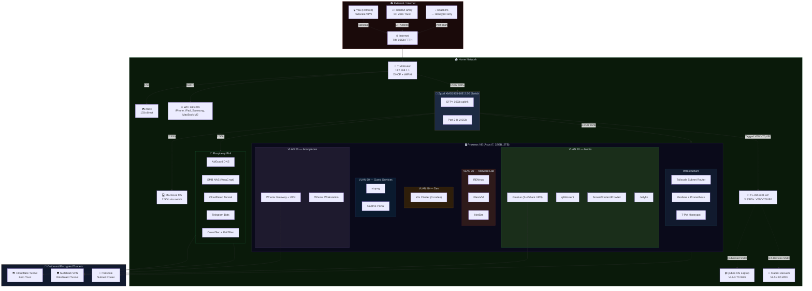

### Physical System Design

In logical design, everything looks neat and coherent with [VLANs](https://en.wikipedia.org/wiki/VLAN), VMs, and containers, but ultimately we need to see what hardware this architecture is going to run on. It was important to me to use the equipment I already had as much as possible and only spend money on things that would genuinely affect expansion capability and isolation; so instead of buying a new mini PC, I decided to convert my old Asus laptop — the one I mentioned earlier — into a [Proxmox](https://www.proxmox.com/en/) server, and spend the main cost on a managed switch and networking equipment.


Additionally, for VLAN segmentation, I need to use a [managed](https://en.wikipedia.org/wiki/Network_switch#Managed_switch) switch. After a lot of searching and trying to find a reliable device at a reasonable price, I landed on the [Zyxel XMG1915-10E](https://www.zyxel.com/it/it/products/switch/8-16-port-2-5gbe-smart-managed-switch-with-2-sfp-uplink-xmg1915-series/overview). I don't know how good it is or whether better options exist in the same price range. I ordered a brand-new open-box unit of this switch for 160 euros from Amazon. If anyone has an opinion or guidance, I'd be happy to receive an email.


In addition to these, I needed 3 more items. First of all, I wanted to use the switch's [SFP+](https://en.wikipedia.org/wiki/Small_Form-factor_Pluggable) port as an uplink and connect it to the 10G port on the router. But since the router's 10G port was of the [RJ45](https://en.wikipedia.org/wiki/Modular_connector#8P8C) type, I needed to get a [10Gtek 10Gb SFP+ RJ45 Copper Module 30-meter (RTL8261 Chip), 10GBase-T SFP+](https://store.10gtek.com/10gbase-t-10g-sfp-30m-copper-rj-45-cat-6a-cat-7-transceiver-module/p-5226) Transceiver:


For building the Access Point, I looked for economical options. I ended up going with the [TP-Link TL-WA1201 AC1200](https://www.tp-link.com/it/home-networking/access-point/tl-wa1201/). With this [Access Point](https://en.wikipedia.org/wiki/Wireless_access_point) I have the ability to simultaneously create multiple [SSIDs](https://en.wikipedia.org/wiki/Service_set_(802.11_network)#SSID) and assign a VLAN to each one, which comes in handy for the scenario of creating a separate SSID for guests and IoT devices. I planned three SSIDs:

| SSID | VLAN | Visibility | Purpose |
|------|------|------------|---------|
| Home-Guest | 60 | Visible | Guest network — with [Captive Portal](https://en.wikipedia.org/wiki/Captive_portal) |
| QubesNet | 70 | **Hidden** | Qubes OS laptop only — with strong WPA3 password |
| IoT-Devices | 80 | Visible | Xiaomi vacuum and future smart devices |


Finally, a set of [Cat8](https://www.cobtel.com/info/cat8-cable-everything-you-should-know-84464412.html) cables. Though there's no need for these cables because, in the best case, we need a cable that supports 10Gb/s — which is used as the switch uplink. But since all the cables I previously bought at home are CAT8, I decided to choose the same type for the new cables I need.

And finally, for the completely isolated environment where I plan to install [Qubes OS](https://www.qubes-os.org/), I'm going to use another old Asus laptop sitting in the closet :)

Below you can see the list of devices and connections I've planned for them:

| Device | Specs | Role | Connection | Speed |
|--------|-------|------|------------|-------|
| TIM WiFi 6 Router | 10Gb FTTH, built-in ONT | Internet gateway, DHCP, WiFi 6 | Fiber (FTTH) | 10Gb |
| [Zyxel XMG1915-10E](https://www.zyxel.com/us/en-us/products/switch/8-16-port-2-5gbe-smart-managed-switch-with-2-sfp-uplink-xmg1915-series) | 8×2.5G + 2×10G SFP+ | VLAN backbone, managed switch | SFP+ → Router (10Gtek module) | 10Gb uplink |
| Raspberry Pi 4 | 8GB RAM, ARM, USB HDD | DNS, NAS, CF Tunnel, bots | Switch port | 1Gb (Pi max) |
| Asus i7 Laptop (2019) | 32GB RAM, 2TB SSD, i7 | [Proxmox](https://www.proxmox.com/en/) hypervisor (all VMs/LXCs) | Switch port (built-in RJ45, likely 1Gb) | 1Gb (upgrade to 2.5Gb later) |
| [TP-Link TL-WA1201](https://www.tp-link.com/it/home-networking/access-point/tl-wa1201/) | AC1200, Multi-SSID, VLAN, Captive Portal | Guest WiFi AP (VLAN 60, 70, 80) | Zyxel switch port (Tagged) | 1Gb |
| MacBook Pro M5 | Work laptop | Daily work, SSH, dev | Switch port (Ugreen 5Gb USB-C adapter, owned) | 2.5Gb (switch max) |
| Xbox | Gaming console | Gaming (low latency priority) | Direct to router | 1Gb |
| Phones/Tablets | iPhone 12, iPad Air, Samsung S24 | Daily use | WiFi 6 | ~1.2Gb |

**Important note on WiFi connection method:** My personal devices (phone, tablet, MacBook M2) connect to the TIM router's own WiFi — i.e., VLAN 1 (home network). The separate AP (TL-WA1201) is only for guests (VLAN 60), the Qubes laptop (VLAN 70), and IoT devices like the Xiaomi vacuum (VLAN 80).

Below you can also see the physical connection schematic:

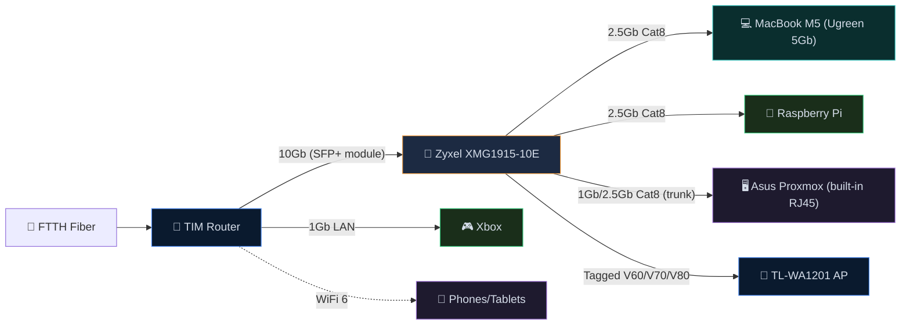

The list of required cables is as follows (distances are estimates):

| Cable | From → To | Category | Length | Speed |
|-------|-----------|----------|--------|-------|
| A | MacBook M5 (Ugreen 5Gb USB-C, owned) → Switch | Cat8 | 1-2m | 2.5Gb (switch caps) |
| B | Xbox → TIM Router (direct) | Cat8 | 0.5-1m | 1Gb |
| C | TIM Router 10Gb → Zyxel SFP+ #1 (via 10Gtek module) | Cat8 | 0.5-1m | 10Gb |
| D | Switch → Raspberry Pi | Cat6 | 0.5-1m | 1Gb (Pi max) |
| E | Switch → Asus Proxmox (built-in RJ45) | Cat8 | 0.5-1m | 1Gb (or 2.5Gb with future USB adapter) |
| F | Zyxel Port 4 → TL-WA1201 Guest AP | Cat8 | 1-1m | 1Gb |

### VLAN Segmentation and Connecting VLANs to Proxmox Containers

Before looking at the VLAN table, it's worth briefly clarifying why [Proxmox](https://www.proxmox.com/en/) is so important in this design. Proxmox plays the role of [hypervisor](https://en.wikipedia.org/wiki/Hypervisor) here; meaning the platform on which VMs and [LXCs](https://linuxcontainers.org/) run. On the other hand, VLANs divide the home's physical network into several separate logical networks. The combination of these two means each service is placed precisely in its own network: for example, the media stack in VLAN 20, the malware analysis environment in VLAN 30, and the anonymous environment in VLAN 50. As a result, management becomes easier, and if a problem arises in one section, it doesn't necessarily spread to the rest of the infrastructure.

In Proxmox, this separation is usually done with separate [Linux Bridges](https://wiki.linuxfoundation.org/networking/bridge) or VLAN-based sub-interfaces. Meaning each VM or container only connects to its own relevant bridge and gets access to its own subnet through that path. This is what allows, for example, a malware analysis machine to have no direct path to the main home network, or download services to only reach the internet via VPN.

| VLAN ID | Name | Subnet | Purpose | Internet Access | Who Can Reach It |
|---------|------|--------|---------|-----------------|-----------------|
| 1 | Home | 192.168.1.0/24 | Your personal devices | Full (TIM router) | All your devices |
| 20 | Media | 192.168.20.0/24 | Torrents + [Jellyfin](https://jellyfin.org/) | VPN only ([Surfshark](https://surfshark.com/)) | VLAN 1 can reach Jellyfin |
| 30 | Malware Lab | 192.168.30.0/24 | [REMnux](https://remnux.org/), [FlareVM](https://github.com/mandiant/flare-vm), [INetSim](https://www.inetsim.org/) | **NONE** (air-gapped) | Nothing. Fully isolated. |
| 40 | Dev | 192.168.40.0/24 | [k3s](https://k3s.io/) cluster, testing | Internet for pulling images | VLAN 1 can reach k3s API |
| 50 | Anonymous | 192.168.50.0/24 | [Whonix](https://www.whonix.org/) + [Tor](https://www.torproject.org/) | VPN → Tor only | Nothing. Fully isolated. |
| 60 | Guest | 192.168.60.0/24 | Guest WiFi | Internet only (throttled) | Nothing internal. Monitored. |
| 70 | Qubes | 192.168.70.0/24 | Dedicated [Qubes OS](https://www.qubes-os.org/) laptop | Internet (VPN+Tor inside Qubes) | Nothing. Fully isolated. |
| 80 | IoT | 192.168.80.0/24 | Xiaomi vacuum, smart devices | Internet only (cloud control) | Nothing internal. Monitored. |

Schematic of how Proxmox container bridges connect to VLANs:

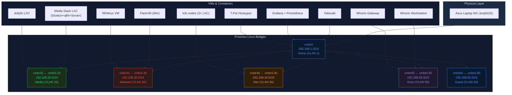

### Media Stack: From Torrent to Something Like Netflix

One of the parts I found very exciting from the beginning was building a proper media stack. That is, a system that starts from finding content, downloads the files, organizes and categorizes them, finds appropriate subtitles if needed, and ultimately displays everything in a neat panel — something similar to the experience you get from Netflix, except this time everything runs on my own infrastructure.

In this design, this entire subsystem sits inside `VLAN 20`. The reason is clear: this section both connects to the outside network and deals with torrents, and is not supposed to be mixed with the other sensitive parts of the home. So it makes more sense to place it in a separate subnet from the start, so it's easier to control, and if something goes wrong one day, the impact won't reach the rest of the network.

The center of this section is [qBittorrent](https://www.qbittorrent.org/). This is the service that does the actual torrent downloading. But the important thing is that I don't want this program to connect to the internet directly. So in this architecture, qBittorrent, instead of having its own independent network, uses [Gluetun's](https://github.com/qdm12/gluetun) network. Gluetun is an intermediary container that brings up the VPN tunnel and passes the traffic of other services through that same tunnel. The result is that qBittorrent essentially has no direct path to the real internet and can only go out via VPN. If the VPN disconnects, the program doesn't fall back to the home's real IP; instead, it effectively has no way to get out. This makes this section much more reliable in terms of IP leaks than conventional setups. This behavior is due to the use of [`network_mode: service:gluetun`](https://docs.docker.com/compose/how-tos/networking/#use-a-pre-existing-network) in Docker — meaning qBittorrent has no independent [network interface](https://en.wikipedia.org/wiki/Network_interface_controller) and only has internet access through Gluetun's network namespace.

For the VPN itself in this design, [Surfshark VPN](https://surfshark.com/) and [WireGuard](https://www.wireguard.com/) are used. Meaning Gluetun brings up the tunnel to the VPN server and all torrent traffic exits through that path. In practice, the peers in the [BitTorrent](https://en.wikipedia.org/wiki/BitTorrent) network that are communicated with don't see my home internet's real IP — they only see the VPN's outgoing IP. This was exactly what I needed for this subsystem: torrenting, but not at any cost.

But just downloading isn't enough. If you have to manually search, grab files, rename them, move them around, and then still go hunt for where they ended up, the whole thing gets exhausting very quickly. This is where other tools come in: [Prowlarr](https://prowlarr.com/), [Sonarr](https://sonarr.tv/), [Radarr](https://radarr.video/), and [Bazarr](https://www.bazarr.media/).

[Prowlarr](https://prowlarr.com/) is responsible for managing indexers — those sources through which torrents are found. [Sonarr](https://sonarr.tv/) is for TV series, [Radarr](https://radarr.video/) for movies, and [Bazarr](https://www.bazarr.media/) for subtitles. The idea is that I specify what film or series I want, and then the rest of the work is largely automated: searching, selecting the right version, sending to qBittorrent for download, organizing the files, and even finding subtitles.

From a storage perspective, these files aren't meant to be scattered. The general workflow is that qBittorrent downloads the files, Sonarr and Radarr after the download completes rename and organize them and place them in appropriate movie and series folders, and then [Jellyfin](https://jellyfin.org/) reads that organized library. That is, in the end, instead of dealing with messy folders, I have a neat and structured archive where each service has played its role in building it.

The final layer of this section is [Jellyfin](https://jellyfin.org/) — the thing that practically turns this stack into something resembling Netflix. Jellyfin is an open-source media server that indexes movie and series files, fetches metadata and posters, displays the library neatly, and provides the ability to stream on browsers, mobile phones, tablets, and TVs. Meaning the final output of this infrastructure isn't just having a bunch of video files in a corner of the hard drive; rather, I have a neat and good-looking panel that displays content like a real streaming service. From this perspective, the idea of a "home Netflix" is exactly here: not just storing films, but building a content consumption experience that is as organized, centralized, and comfortable as possible.

For access inside the home, my devices on the main network can connect to Jellyfin. But for access from outside the home, I didn't want to go with direct port forwarding and opening ports on the router. I don't like it from a security perspective, and I feel there's a simpler solution for this scenario. So for this section I use [Cloudflare Tunnel](https://developers.cloudflare.com/cloudflare-one/networks/connectors/cloudflare-tunnel/) and [Cloudflare Zero Trust](https://www.cloudflare.com/learning/security/glossary/what-is-zero-trust/). The idea is that instead of the service being accessible from the internet directly on the home's IP, an outgoing tunnel from within my own network to Cloudflare is established, and Cloudflare plays the role of access gateway. In this case, I don't need to open ports on the router for Jellyfin or similar panels.

Zero Trust itself is there so that not just anyone can access the service merely by having the service address. Before reaching Jellyfin itself, the user must authenticate at the Cloudflare layer — for example with email or other control methods. This way I can give access only to the people I want — for example, family members or a few close friends. The advantage is that the experience also remains simple for the end user: instead of having to set up VPN for everyone or giving them complex configurations, access can be provided via a controlled and authenticated URL.

### Monitoring the Guest and IoT Network: What Gets Logged and How

One of the reasons I separated the guest network (VLAN 60) and IoT (VLAN 80) from the main network wasn't purely security — I wanted to be able to see exactly what devices connecting to my network are doing. Especially IoT devices like the Xiaomi vacuum that are known for [phoning home](https://en.wikipedia.org/wiki/Phoning_home) to Chinese servers.

The main tool for this is [ntopng](https://www.ntopng.org/), which runs on Proxmox and captures traffic on the `vmbr60` (guest) and `vmbr80` (IoT) interfaces. ntopng is a network traffic monitoring tool that performs [deep packet inspection](https://en.wikipedia.org/wiki/Deep_packet_inspection) and shows the following information for each connected device:

- **Device identity:** IP address, [MAC address](https://en.wikipedia.org/wiki/MAC_address), hostname, operating system (from fingerprint), and vendor (manufacturer) — for example, you can tell whether a device is an Apple iPhone or a Xiaomi
- **Bandwidth:** amount of traffic sent and received by each device in real time and over time
- **Network flows:** each connection source → destination with protocol, number of bytes, duration, and timestamp
- **Sites visited:** from DNS query and flow data
- **Anomaly detection:** suspicious behaviors like port scanning, unusual traffic, or connections to suspicious IPs

In addition to ntopng, [AdGuard Home](https://adguard.com/en/adguard-home/overview.html) also plays a complementary role. If I set the DNS of guest and IoT devices to AdGuard (via DHCP), all [DNS queries](https://www.cloudflare.com/learning/dns/what-is-dns/) from each device are also logged. This way, not only do I see how much traffic a guest or the vacuum generates, but I know exactly which domains it sends DNS requests to — and whether that request was blocked or not.

In practice, the combination of these allows me to see, for example, that the Xiaomi vacuum connects to `ot.io.mi.com` and `de.api.io.mi.com` (Xiaomi's cloud servers) every 30 seconds, how much data it sends, and whether it connects somewhere it shouldn't. Guests similarly: I can see how much bandwidth each guest has consumed, where they've gone, and whether they have any suspicious behavior — of course without the encrypted content (HTTPS) being visible.

### Privacy Mechanisms and Identity Non-Disclosure in Three Subsystems

This section is, for me, one of the most important parts of the design, because it's the most fun part of the whole thing :) In this section we have three separate scenarios:

- A "privacy for use" scenario for the media stack.
- An "anonymous browsing" scenario with [Whonix](https://www.whonix.org/).
- A more stringent scenario for [Qubes OS](https://www.qubes-os.org/).

These three are not identical in terms of goal, threat level, and degree of isolation; therefore they shouldn't be judged by the same standard. What is needed in the media VLAN is more about preventing IP leaks when SEEDing/LEECHing torrents. But in Whonix and Qubes, the discussion goes beyond simply hiding an IP and extends to identity separation, restricting outgoing paths, and reducing the level of trust in the entire system.
Before going into the details, let me say this: there were more secure and privacy-oriented options like [Mullvad VPN](https://mullvad.net/en), but because I still had a long-term [Surfshark](https://surfshark.com/) subscription, and the whole thing is basically built on fun and "coolness," I preferred not to spend my budget on this and to use the VPNs I already have. Besides, the main burden falls on [Tor](https://www.torproject.org/).

As I explained at the beginning of this section, we have three subsystems. One subsystem related to media uses torrents to download movies and series. Since using torrents without a VPN isn't particularly wise, we need to use VPN in a secure manner and structure things in a way that guarantees torrenting never happens without a VPN connection.

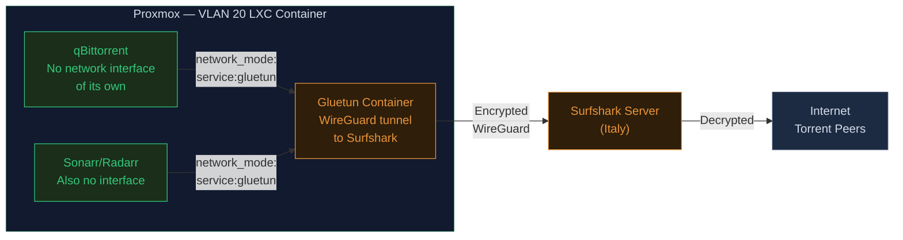

The point isn't that qBittorrent (in case the VPN drops) would want to fall back to the real IP. This program literally has no real IP! No network interface other than the Gluetun tunnel has been given to it. If the tunnel disconnects, qBittorrent's network connectivity drops to absolutely zero. Architecturally, this setup is designed to be completely leak-proof; because there's simply no other interface for any data to leak through.

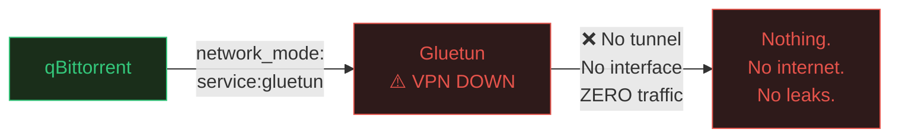

On the other hand, VPN isn't only used for this. In the privacy subsections, the first layer uses VPN. And then requests reach the internet via [Tor](https://www.torproject.org/) or [I2P](https://geti2p.net/en/). This way the ISP doesn't notice Tor usage and only sees VPN-encrypted traffic. You can read the difference between these two [here](https://windscribe.com/blog/i2p-vs-tor/).

```mermaid
graph LR
  subgraph VLAN50["Proxmox — VLAN 50"]
    WS["Whonix Workstation<br/>Your anon desktop<br/>No direct internet"]
    GW["Whonix Gateway<br/>Only VM with<br/>internet access"]
    WS -->|"Internal network<br/>only (vmbr50)"| GW
  end

  GW -->|"WireGuard"| VPN["Surfshark VPN<br/>(future: Mullvad<br/>cash-paid)"]
  VPN -->|"Encrypted"| GUARD["Tor Guard Node<br/>(Entry relay)"]
  GUARD -->|"Encrypted"| MIDDLE["Tor Middle Node<br/>(Relay)"]
  MIDDLE -->|"Encrypted"| EXIT["Tor Exit Node"]
  EXIT -->|"Decrypted"| DEST["Destination<br/>Website"]

  style VLAN50 fill:#111a2e,stroke:#a87bdf55,color:#d4dce8
  style WS fill:#1e1a2e,stroke:#a87bdf,color:#a87bdf
  style GW fill:#1e1a2e,stroke:#a87bdf,color:#a87bdf
  style VPN fill:#2e1e0a,stroke:#e8943a,color:#e8943a
  style GUARD fill:#2e1a1a,stroke:#e5534b,color:#e5534b
  style MIDDLE fill:#2e1a1a,stroke:#e5534b,color:#e5534b
  style EXIT fill:#2e1a1a,stroke:#e5534b,color:#e5534b
  style DEST fill:#1c2a42,stroke:#3d4f68,color:#d4dce8
```

The Workstation's network settings know only one gateway: IP `10.152.152.10` (the [Whonix Gateway](https://www.whonix.org/wiki/Whonix-Gateway)). This machine has no route or path to `192.168.1.1` (the TIM router) or any other public IP. Even if malware runs on the workstation and tries to find the IP, it can ultimately only reach that gateway, and the gateway gives it nothing but a [Tor circuit](https://tb-manual.torproject.org/about/). As a result, that malware, instead of the real IP, sees only an IP belonging to the Tor network.

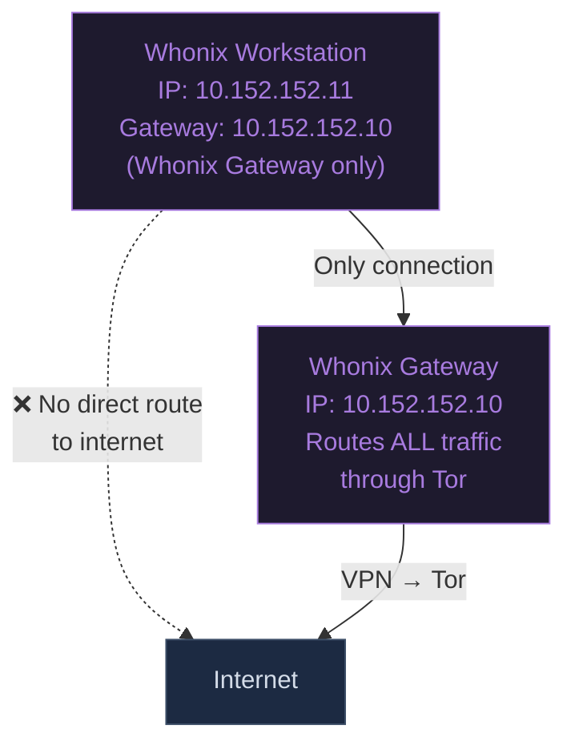

In the third scenario, where maximum privacy is considered and the [Qubes OS](https://www.qubes-os.org/) operating system is used, the system works as follows:


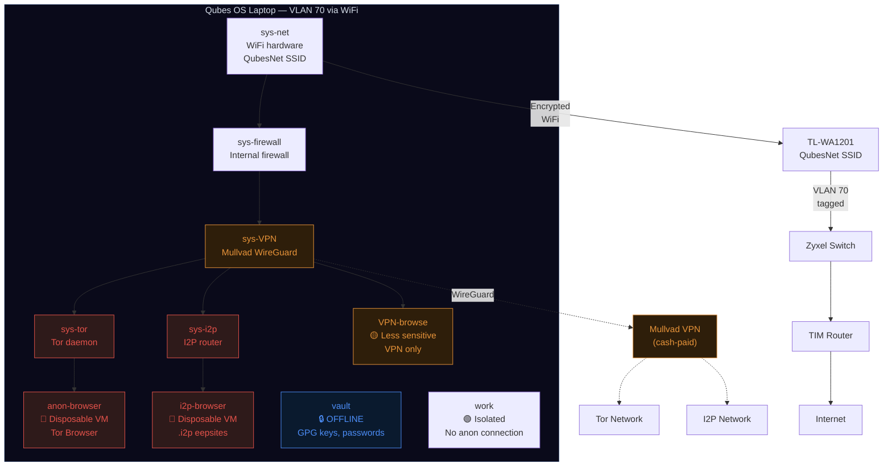

The routing path in Qubes is as follows:

First chain: anonymous web browsing based on [Tor](https://www.torproject.org/)
```
anon-browser → sys-tor → sys-VPN → sys-firewall → sys-net → WiFi → VLAN 70 → Internet
         ↓      ↓
       Tor encrypts  Mullvad encrypts
       (3 layers)   (WireGuard)
```

Second chain: [I2P](https://geti2p.net/en/) Network Access

```
i2p-browser → sys-i2p → sys-VPN → sys-firewall → sys-net → WiFi → VLAN 70 → Internet
         ↓      ↓
       I2P garlic  Mullvad encrypts
       routing    (WireGuard)
```

And the third chain, VPN-only based:

```
VPN-browse → sys-VPN → sys-firewall → sys-net → WiFi → VLAN 70 → Internet
        ↓
      Mullvad encrypts
      (WireGuard)
```

Finally, a comparison of the behavior of these three subsections and the degree of observability in each is examined:

```mermaid
graph TD
  subgraph MEDIA["VLAN 20 — Media Stack"]
    M1["qBittorrent"] --> M2["Gluetun VPN"]
    M2 --> M3["Surfshark"]
    M3 --> M4["Internet"]
  end

  subgraph WHONIX["VLAN 50 — Whonix"]
    W1["Workstation"] --> W2["Gateway"]
    W2 --> W3["Surfshark VPN"]
    W3 --> W4["Tor (3 relays)"]
    W4 --> W5["Internet"]
  end

  subgraph QUBESOS["VLAN 70 — Qubes OS"]
    Q1["Disposable VM"] --> Q2["sys-tor"]
    Q2 --> Q3["sys-VPN (Mullvad)"]
    Q3 --> Q4["Tor (3 relays)"]
    Q4 --> Q5["Internet"]
  end

  style MEDIA fill:#1a2e1a,stroke:#34c77b,color:#d4dce8
  style WHONIX fill:#1e1a2e,stroke:#a87bdf,color:#d4dce8
  style QUBESOS fill:#0a1a2e,stroke:#4d8ef7,color:#d4dce8
```

| | Media (VLAN 20) | Whonix (VLAN 50) | Qubes (VLAN 70) |
|--|----------------|------------------|-----------------|
| **Purpose** | Hide torrents from ISP | Anonymous browsing | Maximum compartmentalized privacy |
| **Encryption layers** | 1 (VPN) | 4 (VPN + 3 Tor) | 4+ (VPN + Tor/I2P + [Xen](https://xenproject.org/) isolation) |
| **ISP sees** | VPN traffic | VPN traffic | VPN traffic |
| **VPN sees** | Torrent traffic | Tor traffic | Tor/I2P traffic |
| **Destination sees** | Surfshark IP | Tor exit IP | Tor exit IP |
| **Leak protection** | Container binding (no interface) | Gateway forces all through Tor | Xen hardware isolation + disposable VMs |
| **If browser compromised** | N/A (no browser) | Attacker sees Tor IP, not real IP | Attacker trapped in disposable VM, destroyed on close |
| **Identity separation** | Surfshark knows your payment | Surfshark knows your payment (for now) | Mullvad doesn't know who you are (cash-paid) |
| **Kill switch** | Architectural (no interface) | Gateway-enforced (Workstation has no route) | [Xen](https://xenproject.org/)-enforced (VM has no route except through chain) |
| **Best for** | Downloading media privately | Sensitive research, [.onion](https://en.wikipedia.org/wiki/.onion) sites | Whistleblowing, journalism, max OpSec |

### Monitoring and Observability Section

As I explained earlier in the Pi monitoring section, the combination of [Prometheus](https://prometheus.io/) + [Grafana](https://grafana.com/) + [node_exporter](https://github.com/prometheus/node_exporter) + [cAdvisor](https://github.com/google/cadvisor) is the basis of my monitoring. Now with the addition of Proxmox and more VLANs, this stack expands. [ntopng](https://www.ntopng.org/) is added for network traffic, [CrowdSec](https://www.crowdsec.net/) for attack detection, and [InfluxDB](https://www.influxdata.com/) as storage for flow data from ntopng.

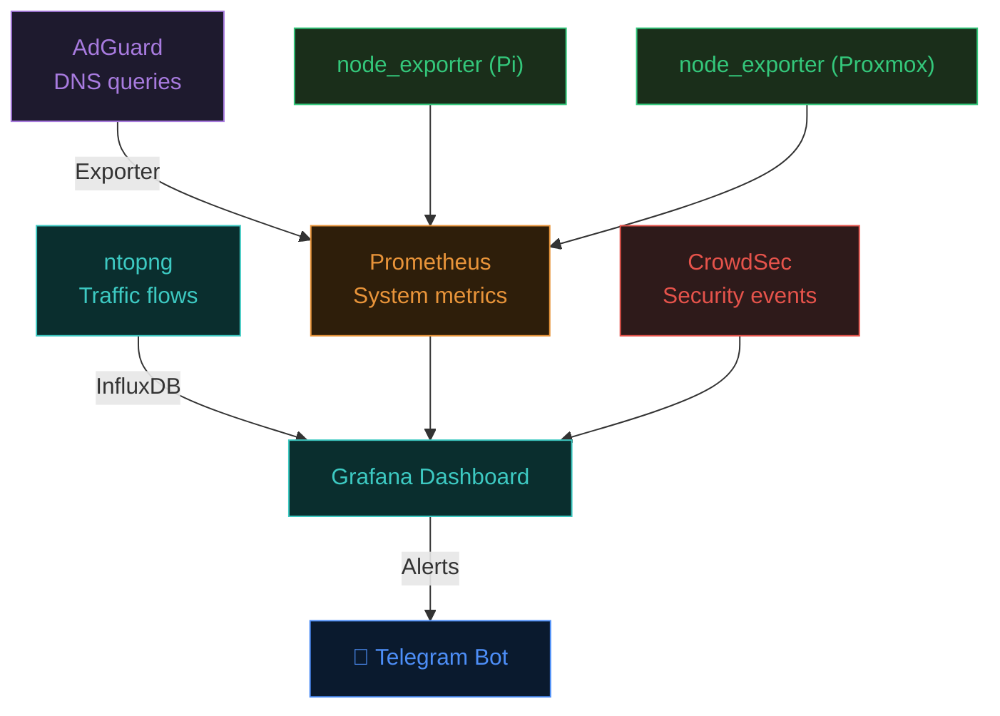

Notifications are also sent via a Telegram bot. Things like: VPN drop, disk full, attack detection by [CrowdSec](https://www.crowdsec.net/), new guest connection, failed SSH login attempt, and services going down. Setting up the bot is also simple: create a bot via [@BotFather](https://t.me/BotFather) on Telegram, get the chat_id, and set it as a Contact Point in Grafana Alerting.


I've tried, up to this point, to write down everything that seemed important in the homelab design. Writing this post genuinely took a lot of time, and I think it's enough for now. I know there are a lot of details that could be covered, but I think I'll save those for another time. Thank you for reading and following along this far. I'll try to keep updating the progress of building the lab on the blog. I'd also be very happy if any friends who have experience in this area had thoughts on improving this architecture, or any notes at all — I'd appreciate an email.

Sincerely,
Alireza
3 AM, Thursday, April 16.