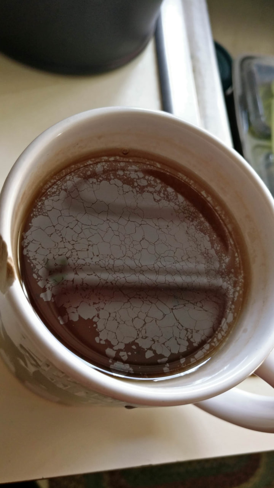
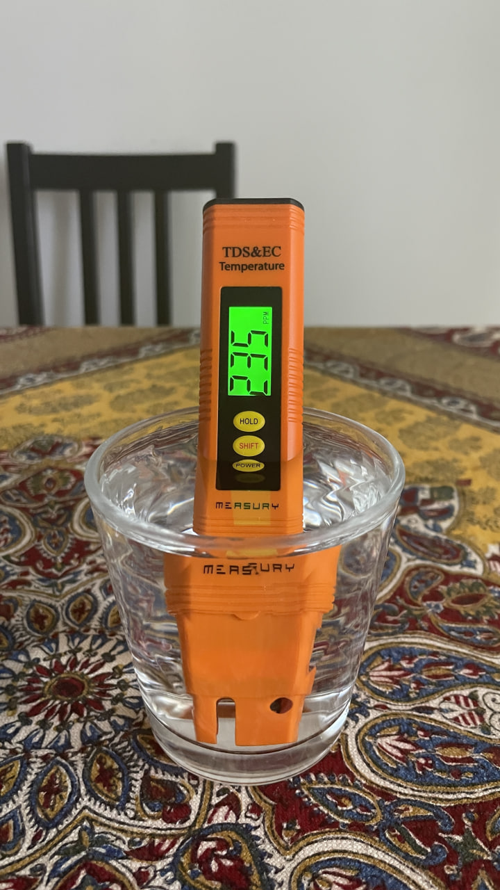
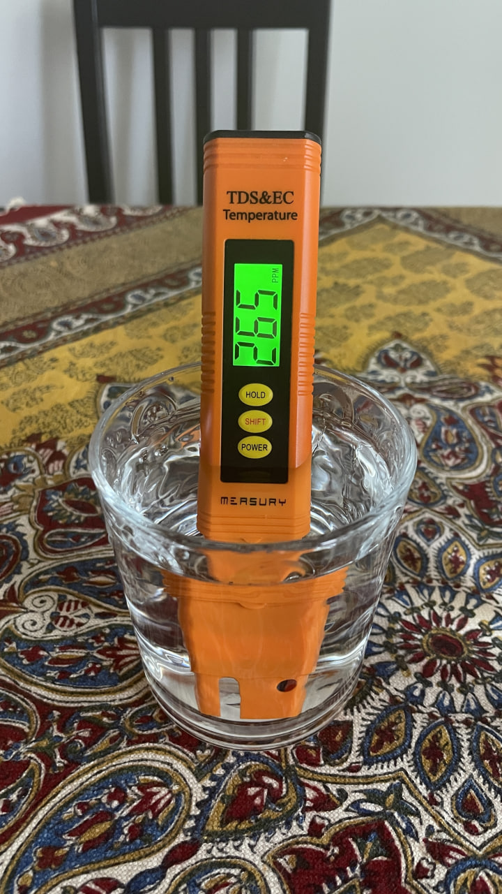

اقا واقعا چایی که با آب با سختی پایین درست میشه تفاوتش با آبی که توی این پارچ‌های تصفیه (که مفتشون واقعا گرونه) تصفیه میشن زمین تا آسمونه.
من مدت‌هاست عشق این رو داشتم که ببینم این ماجرا پارچ‌های تصفیه چیه و عملکردشون چطوره و برای این که فیلتر‌های مختلف رو تست کنم، دو سال پیش رفتم یه TDS meter گرفتم و افتادم به جون اینا و فیلتر‌های مختلف رو خروجی‌شون رو تست میکردم. نکته‌ی مهم اینه که TDS همه‌ی ماجرا نیست ولی واسه کنجکاوی من و ابزاری هم که داشتم همین کافی بود.

من از بین فیلتر‌های معروف تا امروز BWT و Philips رو تست کردم (جزئیات هرکدوم رو میخوام بعدا مفصل بذارم برای همین الان فقط اسم برند میگم) و خروجی اینا اصلا چیزی نبود که انتظار داشتم. بماند که میزان سختی خروجی آب اصلا ثابت نبود، چیزی که واسم عجیب بود این بود که توی مواردی حتی سختی آب بیشتر هم میشد (البته بعضی از این فیلتر‌ها مثل فیلتر منیزیم BWT خودشون یه سری املاح به آب اضافه میکنند و همین میتونی سختی آب رو افزایش بده) سری آخر که فیلتر فلیپس رو تست کردم، یک بار سختی آب رو کم کرده بود و از ۲۴۰ آورده بود روی ۱۸۰. ولی بار‌های دیگه یا همونقدر بود یا حتی بیشتر. و به‌طبع این آزمایش ها رو چند بار در شرایط تا حد امکان یک‌سان تست کردم. BWT باز نتیجه‌ی بهتری میداد هرچند که اون هم باز همچنان روی ۲۰۰ بود و ۲۰۰ سختی زیادیه به‌نسبت.

نکته‌ی اذیت کننده‌ی ماجرا دو تا چیز بود:

۱- من آب‌جوش رو توی فلاسک استیل نگه میدارم. و بعد از چند روز (بین ۱۰ تا ۱۵ روز) جرم آب رو توی چاییم احساس میکردم و خب میدیدم که ته فلاسک رسوب های ریز جمع شده. تمیز کردن فلاسک و کتری برقی با یک چیز اسیدی مثل سرکه یا آب لیمو واقعا حوصله می‌خواست. و همین حس کردن رسوب توی دهن موقع چای خوردن واقعا واسم اذیت کننده بود.

۲- چایی که دم می‌کردم روش لکه‌های روغنی می‌بست. من نمیدونستم چیه که خب از مرجع و منبع علم نوشیدنی و غذا و یار گرمابه و گلستانم، پیمان پرسیدم و اون مثل همیشه یک وویس چند‌ده دقیقه‌ای داد که ماجرا رو بهم توضیح بده چیه. اگر دوست داشتید پیمان چند وویس مفصل (حدود نیم‌ساعت) داره فقط راجع‌به علم پشت چای و دم کردنش و بهداشتش. میتونم اونو حالا با ادیت یا بدون ادیت بذارم اینجا :). خلاصه‌ش اینه که سختی آب باعث این ماجرا میشه. درواقع کلسیم و منزیم آب با پلی فنول‌های چای یک کمپلکسی رو درست میکنه که به شکل لایه‌های نازک چربی روی آب میان (بهش tea scum هم میگن) و رنگ چای رو هم تیره میکنه.

خلاصه اینا خیلی واسم اذیت کننده بود و گفتم مقاومت رو بذارم کنار برم سراغ آب‌های بسته‌بندی و معدنی. علت مقاومتم این بود که آوردن باکس‌های آب و مدیریت بطری‌های خالیش واقعا خودشون گرفتاریه. به هر صورت، امروز رفتم دو باکس آب معدنی گرفتم. رفتم سراغ Sant’Anna  چون می‌خواستم که ببینم اگر سختی رو خیلی پایین بیاریم خروجی چطور میشه و نتیجه واقعا شگفت‌انگیز بود. سختی این آب رو که اندازه‌گیری کردم تشتکم پرید. TDS meter عدد ۱۵ رو نشون میداد. من تا حالا آب کارخونه‌ای با این درجه سختی ندیده بودم. و امشب باهاش چایی دم کردیم و خب نتیجه واقعا عالی بود. چایی خوش‌رنگ، شفاف، سبک و خوش طعم. حتی single-blind test انجام دادیم :)) دوستمون امشب اومده بود خونمون و خب خیلی وقت‌ها اینجا چایی خورده. امشب بدون این که بدونه ما از آب‌معدنی استفاده کردیم به حرف اومد که چایی چقدر خوب شده.  البته بعد تموم شدن اینا میریم سراغ یک آب با سختی بالاتر چون هرچقدر که سختی آب کمتر باشه طعمش بیشتر به تلخی میره و مهم تر از اون این که املاح کم خودش بالانس الکترولیت بدن رو بهم میزنه و همین خودش مصیبتیه. احتمالا بریم سراغ برند Levissima که سختی آبش حدود ۸۰ه.

پی‌نوشت: فرصت نشد از چای امشب عکس بگیرم. یعنی وقتی من رسیدم بالاسرش دیگه مهلت نداشتم برای ریختن واسه خودم. سریع دو تا لیوانم رو سر کشیدم.

Tea scum
و سختی آب قبل و بعد از تصفیه با فیلتر (اونی که بیشتره آبیه که با فیلتر تصفیه شده)

